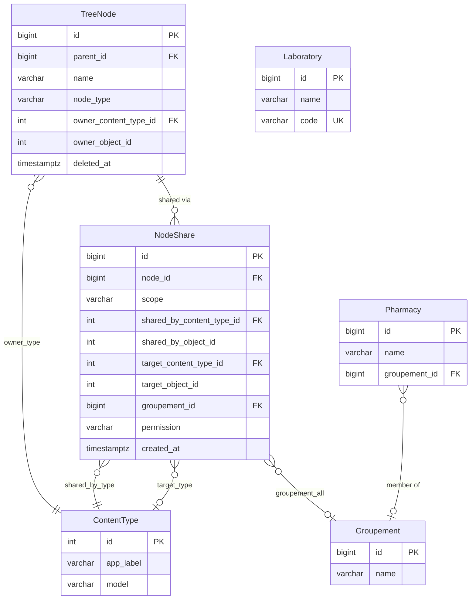
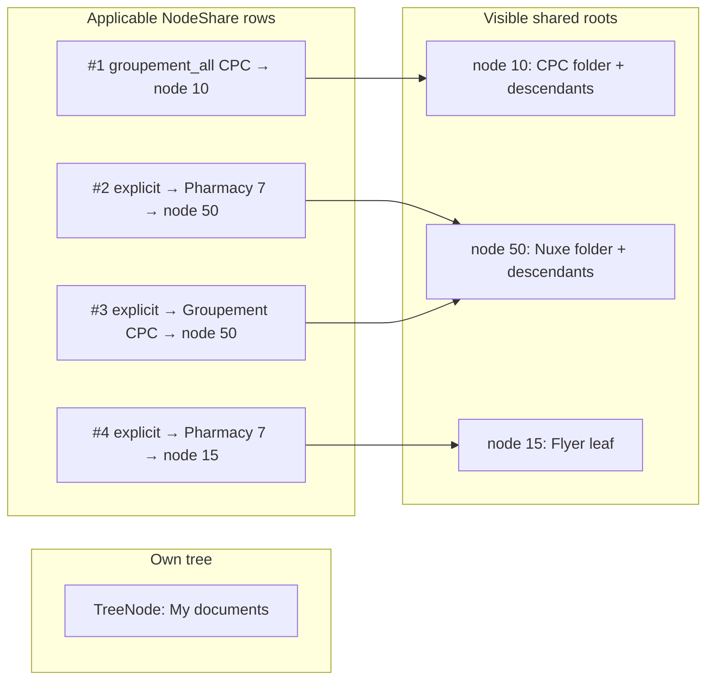

# Technical assessment ADR drafting
_Exported on 6/17/2026 at 23:57:04 GMT-3 from Cursor (3.7.36)_

---

**User**

This is a technical assessment for a senior engineer role.

Based on the following doc, guided by the questions in Fase 1, let's start to draft a ADR to answer those questions.

First, give me an initial version and ask me any additional questions that you feel we should consider.@h:\downloads\test_technique_document_tree_PT-BR.pdf 

---

**Cursor**

Reading the technical assessment document to extract Fase 1 questions and draft an initial ADR.


Checking the workspace for existing project structure or conventions.


Workspace is empty — drafting the ADR from the assessment doc. Asking a few architectural clarifications that could change the design.


**Clarifications for ADR**

> **In which language should the ADR be written?**
> - Portuguese (PT-BR) — matches the assessment doc ✔
> - English
> - English with PT-BR summary

> **When a folder is shared, should all descendants be implicitly visible to recipients (without individual share records per child)?**
> - Yes — share applies to the whole subtree (recommended) ✔
> - No — each node must be shared individually

> **Can we assume PostgreSQL as the database? (affects breadcrumb/subtree query strategy)**
> - Yes — PostgreSQL
> - MySQL / MariaDB
> - Keep it DB-agnostic in the ADR
>
> Answer: Let's also address DB adoption in the ADR

Drafting the initial ADR in PT-BR, covering database choice and implicit subtree sharing.


---

**User**

Let's dive into the decision between adjacency list and materialized path.
Give me further detail on the Trade-offs

---

**Cursor**

Expanding the adjacency list vs materialized path comparison with concrete trade-offs for this document-tree use case. Checking the current plan first.


Expanding the plan with a detailed Adjacency List vs Materialized Path analysis mapped to each endpoint and operation in the assessment.


Here is a deeper comparison, mapped to the operations in the assessment.

## Mental model

Both store the same tree. They differ in **what is denormalized for reads vs kept minimal for writes**.

| | Adjacency List | Materialized Path |
|--|----------------|-------------------|
| **Stored per node** | `parent_id` only | `path` (e.g. `000100010001`), `depth`, often `numchild` |
| **Source of truth** | Parent pointer | Path string |
| **Typical Django** | Plain `models.Model` | `django-treebeard` `MP_Node` |

---

## Operation-by-operation (Fase 2 endpoints)

### 1. List children — `GET /children/` (highest frequency)

Both are a single indexed query:

```sql
-- AL
WHERE parent_id = 10

-- MP
WHERE path LIKE '0001____' AND depth = 2   -- treebeard steplen=4
```

**Verdict: tie.** If the UI navigates lazily level-by-level, MP’s main read advantage barely shows up here.

---

### 2. Breadcrumb — `GET /breadcrumb/`

**AL** needs upward traversal — recursive CTE on PostgreSQL:

```sql
WITH RECURSIVE ancestors AS (
  SELECT * FROM tree_node WHERE id = 12
  UNION ALL
  SELECT n.* FROM tree_node n JOIN ancestors a ON n.id = a.parent_id
)
SELECT * FROM ancestors;
```

Cost: O(depth). For document folders (typically 3–8 levels), this is sub-millisecond on PostgreSQL.

**MP** parses the path and fetches ancestors in one shot:

```python
# path "000100010001" → fetch ["0001", "00010001", "000100010001"]
TreeNode.objects.filter(path__in=paths).order_by('depth')
```

**Verdict: MP wins on elegance and predictability**, but AL with CTE is perfectly fine at this depth. This alone rarely justifies MP.

---

### 3. Aggregated view + shared subtree descendants — `GET /entities/.../tree/`

Hardest read path. You need:
- pharmacy’s own nodes
- shared root nodes (via `NodeShare`)
- **all descendants** of each shared root (implicit subtree sharing)

**AL:** recursive CTE downward from shared root IDs.

**MP:** prefix query per shared root:

```sql
WHERE path LIKE '0001%' OR path LIKE '0042%' ...
```

**Verdict: MP wins when** there are many shared roots and deep subtrees. With ~3–5 shares and depth ≤ 8, both are fine. With 50+ lab shares and large folders, MP (or caching) starts to matter.

---

### 4. Move node — `PATCH /move/` (explicit in Fase 2)

This is the **biggest differentiator**.

Moving a folder with 12 children and grandchildren:

| | AL | MP |
|--|----|----|
| Rows updated | **1** (`parent_id`) | **1 + entire subtree** (rewrite every descendant’s `path`) |
| Concurrency | Simple | Needs locking (path segment collisions) |
| Cycle risk | Possible → validate with walk-up | Structurally impossible |

**Verdict: AL wins clearly.** The assessment asks for move support; MP makes the write path expensive exactly where AL is cheapest.

---

### 5. Insert / delete / rename

- **Insert:** AL is one INSERT; MP must compute the next sibling segment (treebeard handles this).
- **Delete subtree:** Both handle it well (CASCADE or prefix delete).
- **Rename:** Tie — one `UPDATE name`.

---

## Secondary dimensions

### Ordering among siblings

- **MP (treebeard):** order is encoded in the path — `add_sibling(pos='left')` is built-in.
- **AL:** needs an explicit `position` field + reorder logic.

If manual drag-and-drop ordering is a hard requirement, MP gains weight.

### Integrity

- **AL:** cycles are possible if validation is skipped (`A → B → C → A`). Fix: validate in `TreeService.move()` before UPDATE.
- **MP:** cycles are impossible; trade-off is path collision under concurrent inserts/moves.

### Django + polymorphism (GFK owner/content)

- **AL:** plain model, full control — fits the assessment’s custom polymorphic design.
- **MP:** inherits from `MP_Node`, different API (`add_child`, `move`), extra dependency. Works, but couples tree mechanics to treebeard.

### Database portability

- **AL** breadcrumb/subtree: needs recursive CTE (PostgreSQL, MySQL 8+).
- **MP** subtree: `LIKE 'prefix%'` works everywhere with a B-tree index.

Both align with PostgreSQL as recommended in the ADR.

---

## Hybrid option (document, don’t build in PoC)

```python
parent = ForeignKey('self')           # source of truth (AL)
path = CharField(db_index=True)       # denormalized for reads
```

- Reads (breadcrumb, subtree): use `path`
- Writes (move): update `parent_id` + rebuild `path` for the subtree

Same move cost as pure MP, but you choose when to pay it. Good production evolution if CTE becomes a bottleneck; overkill for the PoC.

---

## Decision matrix for this domain

| Criterion | Weight | AL | MP |
|-----------|--------|----|----|
| Cheap `/move/` | High (Fase 2) | ✓✓ | ✗ |
| Simple `/children/` | High | ✓ | ✓ |
| Breadcrumb | Medium | ✓ (CTE) | ✓✓ |
| Aggregated subtree | Medium | ✓ (CTE) | ✓✓ |
| Django simplicity + GFK | High (PoC) | ✓✓ | ✓ |
| Manual sibling ordering | Low (TBD) | extra field | ✓✓ |

**Recommendation stays Adjacency List** because:
1. Move is a first-class Fase 2 requirement
2. Navigation is lazy (`/children/`), not full-tree loads
3. Expected depth is moderate
4. Polymorphic model stays simpler without treebeard

**When I’d switch to MP:** full-tree loads are dominant, depth > 10, moves are rare, and manual ordering is a core UX requirement.

---

I've added this full section to the plan under **Questão 1 — Aprofundamento — Adjacency List vs Materialized Path**.

One thing that could flip the decision: **how often users reorganize folders vs how often they load full aggregated trees**. If you have a sense of that ratio, we can sharpen the recommendation further.

---

**User**

Adicione uma seção de riscos com os planos de mitigação dos riscos para cada alternativa num cenário de crescimento da escala do uso do projeto.
Trate especificamente do caso de crescimento da visão agregada para o AL e uma alta escala de escrita no caso de MP e adicione outros casos caso necessário.

---

**Cursor**

Adicionando uma seção de riscos e mitigações por alternativa (AL e MP) ao plano do ADR, com foco em escala da visão agregada e em escrita no MP.


Fixing a line break typo in the plan file.


Adicionei ao plano a seção **"Riscos em cenário de crescimento e planos de mitigação"**, logo após a comparação AL vs MP. Resumo do que entrou:

## Estrutura da seção

**Cenários de escala** — tabela com ordens de grandeza (PoC vs produção madura) para calibrar quando cada risco se materializa.

### Riscos específicos do AL (decisão atual)

| ID | Risco | Foco |
|----|-------|------|
| **R1** | Degradação da **visão agregada** | CTE recursiva + muitos shares + subtrees grandes |
| R2 | Limites de CTE / profundidade | `work_mem`, profundidade > 15 |
| R3 | Hot spot em inserts | Muitas folhas na mesma pasta |
| R4 | Ciclo em move | Concorrência no walk-up |

**R1** tem plano em 6 fases: lazy depth → otimização de CTE → cache Redis → híbrido AL+`path` → snapshot assíncrono → migração estrutural (MP/Closure Table), com critérios de escalação (p99 > 500 ms, etc.).

### Riscos específicos do MP (alternativa)

| ID | Risco | Foco |
|----|-------|------|
| **R6** | **Alta escala de escrita em move** | N UPDATEs por subtree movida |
| R7 | Contenção em insert entre siblings | Lock no pai (treebeard) |
| R8 | Esgotamento de segmentos de path | Limite teórico de siblings |
| R9 | Degradação de índice prefix | `LIKE 'XXXX%'` em tabela grande |

**R6** inclui mitigações em fases: limitar tamanho de subtree movível → move assíncrono (202) → UPDATE set-based → filas por owner → regressão a AL/híbrido.

### Riscos comuns (AL e MP)

- **R10** — cache stale (segurança + consistência) → `tree_version`
- **R11** — payload JSON gigante → paginação por nível
- **R12** — replica lag pós-write → read-your-writes (MP pior que AL)

### Fechamento

- Matriz resumo risco × alternativa
- Métricas e alertas mínimos (`aggregated_view.duration`, `move.descendants_updated`, etc.)

A conclusão do ADR permanece **AL**, mas agora com rota de evolução explícita: se R1 persistir após cache, o híbrido AL+`path` é o próximo passo antes de considerar migração completa para MP.

Quer que eu incorpore algum limiar específico (ex.: número exato de farmácias ou SLA de latência) com base no que vocês esperam para a plataforma Opeaz?

---

**User**

Mova a seção de riscos para uma seção de Riscos ao fim do documento com uma referencia na seção da Q1

---

**Cursor**

Movendo a seção de riscos para o final do documento e adicionando uma referência na Q1.


Feito. Alterações no plano:

**Na Q1** — após a decisão final, ficou uma referência curta:

> **Riscos e mitigação em escala:** … seção [Riscos](#riscos) ao final deste documento. Destaques: **R1** (visão agregada com AL) e **R6** (escrita com MP).

**Ao fim do documento** — nova seção `## Riscos` (entre *Perguntas em aberto* e *Próximos passos*), com:
- Link de volta à Q1
- Hierarquia ajustada (`##` → `###` → `####`)
- Conteúdo intacto (R1–R12, matriz, observabilidade)

Ordem final do ADR: Q1–Q8 → Diagrama → Perguntas em aberto → **Riscos** → Próximos passos.

---

**User**

Vamos alinhar as perguntas em aberto

---

**Cursor**

Para fechar o ADR, preciso das suas respostas às 7 perguntas em aberto — envio o formulário com as opções recomendadas onde fizer sentido.


**Alinhar perguntas em aberto do ADR**

> **1. Lab → Pharmacy direto: farmácia fora do agrupamento alvo pode receber share de um laboratório?**
> - Sim, sem restrição (lab compartilha com qualquer farmácia) ✔
> - Sim, mas farmácia deve pertencer a algum agrupamento parceiro do lab
> - Não — lab só compartilha via agrupamento (nunca direto com farmácia)

> **2. Ordenação entre nós irmãos (siblings)**
> - created_at (ordem de criação) — mais simples para PoC
> - Alfabética por name ✔
> - Ordem manual via campo position (drag-and-drop futuro)

> **3. Naming de nós compartilhados — ex.: "CPC [compartilhado pelo Agrupamento]"**
> - display_name computado na API (TreeNode.name permanece "CPC")
> - Parte do TreeNode.name real no banco
> - Campos separados: name + shared_by metadata; UI monta o rótulo ✔

> **4. Como a entidade requisitante é identificada na API?**
> - URL path — ex.: /entities/pharmacy/7/tree/ (PoC / teste técnico)
> - JWT claim — entidade derivada do token autenticado
> - JWT claim + validação cruzada com entity_id na URL
>
> Answer: Seguimos a URL path mas documentamos a opção de JWT claim

> **5. Exclusão de nós**
> - Hard delete (CASCADE) — mais simples para PoC
> - Soft delete (deleted_at) — recuperável, shares pausados ✔
> - Soft delete documentado como evolução futura; hard delete na PoC

> **6. Escala esperada — calibrar mitigações e cenários de risco**
> - Manter premissas do ADR (50–200 nós/owner PoC; até 50k produção; 500–2k farmácias/agrupamento) ✔
> - Escala modesta (< 500 nós/owner; < 100 farmácias/agrupamento)
> - Escala agressiva desde cedo (> 10k nós/owner; > 1k farmácias/agrupamento)

> **7. Resolução de folha — URLs de Document.file / Flyer.image**
> - URL assinada (S3/GCS) com TTL curto
> - Path interno / endpoint proxy da API
> - URL assinada na resposta; detalhes de storage fora do escopo da PoC ✔

Atualizando o plano com as decisões alinhadas e refletindo-as nas seções relevantes do ADR.


As 7 perguntas foram alinhadas e o ADR atualizado. Resumo das decisões e onde entraram no documento:

| # | Decisão | Impacto no ADR |
|---|---------|----------------|
| 1 | Lab → Pharmacy **sem restrição** | Q3 — tabela de regras e limitações |
| 2 | Ordenação **alfabética por `name`** | Q1, Q7, Q8 — sem campo `position` |
| 3 | **`name` + `shared_by` separados**; UI monta rótulo | Q7, Q8 — contrato de resposta |
| 4 | **URL path** na PoC; JWT claim documentado para produção | Q6 — nova subseção de contexto |
| 5 | **Soft delete** (`deleted_at`) | Q6 — subseção 6c; modelo `TreeNode` |
| 6 | **Premissas de escala do ADR** mantidas | Seção Riscos (já calibrada) |
| 7 | **URL assinada** na resolução de folha; storage fora da PoC | Q4 |

A secção **"Perguntas em aberto"** passou a **"Decisões alinhadas"** com a tabela consolidada.

Destaques de implementação para a Fase 2:
- `TreeNodeManager` que filtra `deleted_at IS NULL` por defeito
- `order_by('name')` em `/children/` e visão agregada
- `TreeService` recebe entidade resolvida — isolando URL path vs JWT no futuro
- Serializer de conteúdo devolve `file_url` / `image_url` assinados via adapter

Quer rever alguma decisão antes de gravarmos o ADR final em `docs/adr/001-document-tree.md`?

---

**User**

Translate the doc to English

---

**Cursor**

Translating the full ADR plan document to English.


The full ADR plan is now in **English**. Summary of what changed:

**Structure preserved**
- All 8 questions, aligned decisions, risks, diagrams, and code blocks
- Domain model names kept as-is: `Groupement`, `Laboratory`, `Pharmacy`, `NodeShare`
- Internal links updated (e.g. `#question-1--tree-structure`, `#risks`)

**Notable translations**
- Section titles: *Questão* → *Question*, *Decisões alinhadas* → *Aligned decisions*, *Riscos* → *Risks*
- Mermaid flowchart labels translated (e.g. *Move frequente?* → *Frequent moves?*)
- Example UI strings translated (*Meus documentos* → *My documents*, *Condições 2025* → *Conditions 2025*)
- Draft version bumped to **v0.2** in the title

**Todo updated**
- `write-adr-file` now targets `docs/adr/001-document-tree.md` **(English)**

If you want a bilingual deliverable (EN doc + PT-BR summary), or to export this to `docs/adr/001-document-tree.md`, say the word.

---

**User**

Give me a table view and a database schema draw for question 3

---

**Cursor**

Adding a column-level schema table and an ER diagram to Question 3 in the plan.


Question 3 now includes a column-level schema table, an ER diagram, and a share-scenarios table. Here is the content added to the plan:

---

## Database schema — `NodeShare` table

| Column | Type | Null | FK / Ref | Description |
|--------|------|------|----------|-------------|
| `id` | `bigint` PK | NO | — | Surrogate key |
| `node_id` | `bigint` | NO | → `tree_node.id` | Root of shared subtree; descendants inherited at query time |
| `scope` | `varchar(20)` | NO | — | `explicit` \| `groupement_all` |
| `shared_by_content_type_id` | `int` | NO | → `django_content_type.id` | ContentType of sharer (Laboratory, Groupement) |
| `shared_by_object_id` | `int` UNSIGNED | NO | — | PK of sharer instance |
| `target_content_type_id` | `int` | YES | → `django_content_type.id` | Required when `scope=explicit` |
| `target_object_id` | `int` UNSIGNED | YES | — | PK of recipient (Pharmacy or Groupement) |
| `groupement_id` | `bigint` | YES | → `groupement.id` | Required when `scope=groupement_all` |
| `permission` | `varchar(20)` | NO | — | Default `read_only` |
| `created_at` | `timestamptz` | NO | — | Audit timestamp |

**Check constraints**

| Name | Rule |
|------|------|
| `nodeshare_scope_explicit` | `scope='explicit'` → `target_*` NOT NULL; `groupement_id` IS NULL |
| `nodeshare_scope_groupement_all` | `scope='groupement_all'` → `groupement_id` NOT NULL; `target_*` IS NULL |

---

## Schema diagram



**Key relationships**
- `NodeShare.node` → shared **root** only (subtree inherited implicitly)
- `shared_by` (GFK) → Laboratory or Groupement that created the share
- `target` (GFK) → Pharmacy or Groupement when `scope=explicit`
- `groupement` → only for `scope=groupement_all`; all member pharmacies gain access

---

## Share scenarios (example rows)

| id | node_id | scope | shared_by | target / groupement | Who sees it |
|----|---------|-------|-----------|---------------------|-------------|
| 1 | 10 *(folder "CPC")* | `groupement_all` | Groupement CPC (#3) | `groupement_id=3` | All pharmacies in CPC |
| 2 | 50 *(folder "Nuxe")* | `explicit` | Laboratory Nuxe (#8) | Pharmacy #7 | Pharmacy #7 only |
| 3 | 50 *(folder "Nuxe")* | `explicit` | Laboratory Nuxe (#8) | Groupement CPC (#3) | All CPC pharmacies |
| 4 | 15 *(leaf "Flyer")* | `explicit` | Groupement CPC (#3) | Pharmacy #7 | Pharmacy #7 *(validates `groupement_id == 3`)* |

**Resolution flow for Pharmacy #7**



---

This is now in **Question 3** of the plan. If useful, we can add a similar schema view for Q2 (polymorphic owner/content on `TreeNode`) or export Q3 as a standalone section for the deliverable.

---

**User**

Without adding to the doc, explain briefly the "Partial revocation" limitation and practical scenarios

---

**Cursor**

**Partial revocation** means: once you share a folder, recipients see the **entire subtree** under it. You cannot revoke visibility for one child while keeping the rest of the folder shared.

Sharing is anchored on the **root node** (`NodeShare.node`). Descendants are included by inheritance at query time, not by individual share rows. So there is no per-child grant or revoke.

### Practical scenarios

**1. Groupement shares "Conditions 2025" but wants to hide one file**

CPC shares the folder `Conditions 2025` with all member pharmacies. Later they add `Draft - internal only.pdf` inside that folder and want only CPC admins to see it — not pharmacies.

**Problem:** Pharmacies still see the draft, because it lives under the shared root.

**Workaround:** Move the draft outside the shared folder, or share subfolders individually instead of the parent.

---

**2. Lab shares a product folder; one flyer is pharmacy-specific**

Nuxe shares `Spring campaign/` with Groupement CPC. One leaflet inside is meant for Pharmacy #12 only.

**Problem:** Every CPC pharmacy sees that leaflet.

**Workaround:** Put pharmacy-specific content in a separate folder and share that folder only with Pharmacy #12.

---

**3. Temporary removal of a document from a shared catalogue**

A flyer expires and should disappear for pharmacies, but the parent folder `Promotional flyers/` stays shared.

**Problem:** You cannot "unshare" just that leaf while the folder share remains.

**Workaround:** Soft-delete or move the leaf out of the shared subtree; or stop sharing the whole folder and re-share only the folders that should remain visible.

---

**4. Progressive rollout within the same folder**

A groupement wants to release documents weekly inside `Conditions 2025` without re-sharing each time, but also without exposing future documents early.

**Problem:** Anything added under the shared root is immediately visible.

**Workaround:** Share subfolders per release (`Week 1/`, `Week 2/`) and only create/share each when ready.

---

### Why the ADR accepts this

It keeps the model simple: one share row per shared root, no per-descendant ACLs, and no copy-on-write trees. The trade-off is **coarse-grained sharing** — folder-level, not file-level, unless you structure the tree that way on purpose.

---

**User**

Does this apply to subfolders?

---

**Cursor**

Yes — **for anything inside a shared root**, including subfolders.

The rule is: **everything under the shared node is visible**, regardless of depth or node type (folder or leaf). There is no “share parent, hide one subfolder” without changing structure or shares.

### What that means

**Share `Conditions 2025/` with all pharmacies**

```
Conditions 2025/          ← share root
├── General conditions/   ← visible
├── Q1/                   ← visible
└── Drafts/               ← also visible — cannot hide only this
```

You cannot revoke `Drafts/` alone while keeping the rest of `Conditions 2025/` shared.

### What you *can* do with subfolders

**Share at subfolder level instead of the parent**

If you share only `Conditions 2025/Q1/`, then `Q2/` and `General conditions/` are **not** shared — but because you never shared the parent, not because you partially revoked it.

**Multiple independent shares**

- Share `Flyers/` → all pharmacies  
- Share `Internal/` → one pharmacy only  

That works if those are **separate share roots**, not one parent share with an exception.

### Short answer

| Situation | Partial revocation? |
|-----------|------------------------|
| Hide a **subfolder** inside an already shared parent | **No** |
| Share a **subfolder only** (not the parent) | **Yes** — by choosing a finer share root |
| Hide a **file** inside a shared folder | **No** (same rule) |

So the limitation applies to **any descendant** of a share root — subfolders and leaves alike. Finer control means **sharing smaller folders** or **restructuring the tree**, not revoking one branch under an existing share.

---

**User**

What would be the impact of having every subfolder share node be persisted?

---

**Cursor**

**Persisting a `NodeShare` row per subfolder** (instead of one root share + implicit subtree inheritance) mainly trades **simpler reads and finer revocation** for **much heavier writes, sync logic, and storage**.

## Two ways to interpret “persist every subfolder”

### A. Materialized shares (fan-out on share)

Sharing `Conditions 2025/` creates `NodeShare` rows for **that node and every current descendant**.

### B. Direct-share-only (no inheritance)

A node is visible **only if it has its own** `NodeShare` row — not because an ancestor was shared.

Most real designs end up as **A + sync on tree changes**, or **A + exclusions** if you still want auto-visibility for new children.

---

## Impact by area

### 1. Partial revocation — **improves (if modeled carefully)**

You can revoke one subfolder by deleting (or denying) its share row(s), while sibling subfolders keep theirs.

**Catch:** if you **keep ancestor inheritance** (“share parent ⇒ new files still appear”), deleting a subfolder’s row is **not enough** — descendants would still match the parent share. You then need either:

- **No inheritance** — only direct `NodeShare.node_id` counts → partial revoke works, but new nodes under a “shared” folder are **not** shared until you copy/create rows, or  
- **Inheritance + exclusions** — e.g. `NodeShareDenial(node_id, share_id)` → more complexity, back toward a richer ACL model.

So persistence alone doesn’t fix partial revocation unless you **drop or complement** implicit inheritance.

---

### 2. Share creation — **write amplification**

| Model | Rows when sharing one folder (500 nodes) with CPC (groupement_all) |
|--------|---------------------------------------------------------------------|
| Current (root only) | **1** |
| Per-subfolder persisted | **~500** |
| Per-subfolder × each pharmacy (explicit) | **~500 × N pharmacies** |

`POST /shares/` becomes a **bulk job**, not a single insert — especially bad for lab → many pharmacies.

---

### 3. Tree mutations — **ongoing sync burden**

Every structural change must keep shares consistent:

| Event | Current model | Persisted subfolder shares |
|--------|----------------|----------------------------|
| New subfolder under shared tree | Visible automatically | Insert new `NodeShare` row(s) (copy from parent scope) |
| Move folder | No share change | Update/delete/create many rows |
| Copy subtree | N/A | Duplicate all share rows |
| Soft delete node | Hidden via `deleted_at` | Also deactivate/delete share rows |

You need **signals or `TreeService` hooks** so the tree and share table never drift.

---

### 4. Read path — **can get simpler**

Today, visibility for descendants often needs: *“share on this node **or** an ancestor”* → recursive CTE or ancestor walk.

With a row on **every** shared node and **direct-match-only** visibility:

```sql
SELECT t.* FROM tree_node t
JOIN node_share s ON s.node_id = t.id
WHERE <target matches entity>;
```

No descendant CTE for share resolution — **R1 (aggregated view)** can get lighter.

That’s the main technical reason to materialize shares.

---

### 5. Storage & R5 — **worse at scale**

`node_share` grows with **nodes × share operations**, not just share operations.

Example: 50 labs each share a 1,000-node catalogue with one groupement → **50 × 1,000 = 50k rows** vs **50 rows** today.

Indexes on `(target_content_type, target_object_id)` and `(node_id)` matter more; partitioning becomes likely sooner.

---

### 6. Semantics — **duplication and conflicts**

Same subtree may have shares on parent **and** child (redundant). Rules needed for:

- Revoke parent but child row still exists  
- Overlapping shares (groupement + lab on same node)  
- Idempotent share API (`UNIQUE (node_id, target, scope)`)

---

### 7. `GROUPEMENT_ALL` — **modest vs catastrophic**

| Scope | Per-subfolder impact |
|--------|----------------------|
| `GROUPEMENT_ALL` | ~N rows per share (N = subtree size) — often acceptable |
| `EXPLICIT` per pharmacy | N × pharmacies — **R5 explosion** |

---

## Summary trade-off

| | Root share + inheritance (current) | Persisted share per subfolder |
|--|-----------------------------------|------------------------------|
| Partial revocation | No (without restructure) | Yes, if inheritance dropped or exclusions added |
| Share API cost | Low (1 row) | High (fan-out / async job) |
| New node under shared folder | Automatic | Requires sync |
| Move / delete | Simple | Many row updates |
| Read / aggregated view | CTE for descendants | Simpler JOIN |
| Table size | Small | Large |
| Mental model | “Share this folder” | “Share this folder **and** mirror to all nodes” |

---

## Practical recommendation

**Full persistence on every subfolder** is usually only worth it if:

- partial revocation is a **hard product requirement**, and  
- you accept **async share materialization** + **sync on tree CRUD**, or an **exclusion** model.

Otherwise, the current design (share at the **smallest folder that matches the intent**) gives most of the benefit without fan-out:

- Share `Conditions 2025/Q1/` instead of all of `Conditions 2025/` when Q2 should stay private.

A middle ground used in production: **keep root inheritance**, add **`NodeShareDenial`** only when partial revoke is needed — fewer rows than full materialization, more complex queries.

I can sketch that hybrid (inheritance + denial table) against your Q3 schema if you want to compare it for the ADR.

---

**User**

Add a schema diagram to Q4

---

**Cursor**

Added a **Schema diagram — content polymorphism** section to Question 4 in the plan. It includes:

1. **ER diagram** — `TreeNode` content fields (`content_content_type_id`, `content_object_id`), `ContentType`, and the four business types (`Document`, `Flyer`, `CommercialCondition`, `Contract` as future), all linked to `Laboratory`.

2. **GFK resolution flow** — how a leaf node resolves to the correct content model at runtime via `ContentType.model`.

3. **Column rules table** — folder vs leaf invariants with examples from the assessment (`Document #5`, `Flyer #38`, `CommercialCondition #12`).

The diagram makes explicit that content polymorphism uses **no per-type FK columns** on `tree_node` — only the GFK pair plus allowlist validation in the service layer.

---

**User**

Summarize the decision with a clear text on question 7.
Explaining that we will query own nodes, shared nodes and only show the first level of children folders/leaves

---

**Cursor**

Updating Question 7 with a clear decision summary and aligning the construction strategy to depth-1 only (no full subtree CTE).


Question 7 now opens with an explicit **Decision** section. Summary:

---

**Aggregated view = bootstrap, not full tree**

When a Pharmacy calls `GET /entities/pharmacy/7/tree/`, the API returns two merged sets, **depth-limited to one level below each root**:

1. **Own nodes** — roots owned by the pharmacy (`parent_id IS NULL`) plus **only their direct children** (folders and leaves).

2. **Shared nodes** — shared roots from applicable `NodeShare` rows, plus **only their direct children**. Deeper shared content (e.g. `"General conditions"` under `"Conditions 2025"`) is **not** included here.

3. **Deeper navigation** — the client loads lower levels via `GET /tree-nodes/{id}/children/` as the user expands folders.

This avoids loading full shared subtrees on every page load, keeps the response small, and matches typical tree UI behaviour (top-level sections like *My documents*, *CPC*, *Nuxe*, with one level visible; expand to go deeper).

---

The old **Query C (recursive CTE for all descendants)** was removed from the aggregated view and replaced with explicit depth-1 SQL steps. The performance table was updated to match this approach.

---

**User**

Change "Aligned decisions" section name to "Assumptions and Decisions"

---

**Cursor**

Renamed **"Aligned decisions"** to **"Assumptions and Decisions"** and updated the intro line to:

> Architectural assumptions and resolved design choices for this ADR:

Also fixed a small markdown typo on the soft delete row (`**deleted_at**`).

---

**User**

Is "permission": "read_only" really relevant in the API response given that all fields that are shared will be read only?

---

**Cursor**

Given the current rules, **`permission` is mostly redundant**.

### What the ADR already implies

| State | Meaning | Mutations |
|--------|---------|-----------|
| `is_owned: true` | Node belongs to the requesting entity | Allowed (owner) |
| `is_shared: true` | Visible via `NodeShare` | **Always blocked** server-side |

So the client can derive:

```text
read_only = is_shared
can_edit  = is_owned   // for PoC, where owner ⇒ full access
```

You don’t need a separate field to know shared content is read-only — **`is_shared` already encodes that**.

### When `permission` would matter

It adds value only if you expect **more than two access levels**, for example:

- `read_only` vs `read_write` on shared nodes (not in scope today)
- Role-based rights on **owned** nodes (e.g. pharmacy staff vs admin)
- Different actions per node (`can_share`, `can_move`, …)

The ADR currently says `permission` has a **single value** (`read_only`) for recipients — so it’s documentation of an invariant, not extra information.

### Recommendation

**For the PoC / this assessment:** you can drop `permission` from the response and rely on:

- `is_owned` / `is_shared` for the UI (disable actions when `is_shared`)
- Server enforcement (`IsNodeOwner`) regardless of what the client shows

**If you want future-proofing without noise:** either keep a short note in the ADR (“shared nodes are read-only; not exposed as a field”) or use a richer **`capabilities`** object later when multiple permissions exist — not a static `"read_only"` on every row.

### Bottom line

**Not really relevant today** — it repeats what `is_shared: true` already tells the client. Keeping it is harmless but redundant; removing it makes the API leaner and avoids implying a permission system that doesn’t exist yet.

If you want, we can update Q7/Q8 in the plan to remove `permission` from the response examples and document the `is_owned` / `is_shared` convention instead.

---

**User**

Update the questions to remove permission from response examples

---

**Cursor**

Updated Q6, Q7, and Q8 to drop `permission` from API response examples and prose:

- **Q6 (6a):** Shared nodes use `is_shared: true`; read-only behaviour is implied and enforced by `IsNodeOwner`.
- **Q7:** Metadata is `is_owned`, `is_shared`, `shared_by` only; note that read-only is derived from `is_shared`.
- **Q8:** JSON examples no longer include `permission`; bullets clarify `is_owned` ⇒ mutable, `is_shared` ⇒ read-only.

**Unchanged:** `NodeShare.permission` in the Q3 model/schema (internal storage for future use). It is not exposed in read responses.

---

**User**

Implement the plan as specified, it is attached for your reference. Do NOT edit the plan file itself.

To-do's from the plan have already been created. Do not create them again. Mark them as in_progress as you work, starting with the first one. Don't stop until you have completed all the to-dos.

---

**Cursor**

Implementing the ADR plan: reading the attached plan and assessing the workspace.


Creating the ADR file, then scaffolding the Django project and implementing Phase 2.


Implementation is complete. Summary:

## Deliverables

### 1. ADR — [docs/adr/001-document-tree.md](h:\workspace\opeaz\docs\adr\001-document-tree.md)
English architecture document (v0.2), exported from the plan without frontmatter or implementation meta.

### 2. Django PoC — Phase 2

**Project layout**
- `config/` — Django settings & URLs
- `core/` — `Groupement`, `Pharmacy`, `Laboratory`, `Document`, `Flyer`, `CommercialCondition`
- `document_tree/` — `TreeNode`, `NodeShare`, services, API, tests

**Architecture (per ADR)**
- Adjacency list tree with soft delete (`deleted_at`)
- Polymorphic owner & content via ContentTypes
- `NodeShare` with `explicit` and `groupement_all` scopes
- Depth-limited aggregated view (roots + first-level children)
- Alphabetical sibling ordering
- No `permission` in API responses (`is_owned` / `is_shared` only)

**API** (`/api/v1/`)
| Endpoint | Purpose |
|----------|---------|
| `GET entities/{type}/{id}/tree/` | Aggregated bootstrap view |
| `GET tree-nodes/{id}/children/` | Lazy navigation |
| `GET tree-nodes/{id}/content/` | Resolve leaf (+ signed URLs for files) |
| `POST tree-nodes/{id}/shares/` | Create share |
| `GET tree-nodes/{id}/breadcrumb/` | Root → node path |
| `PATCH tree-nodes/{id}/move/` | Reparent node |

**Tests:** 15 passing (nominal + error cases per endpoint)

```bash
pip install -r requirements.txt
python manage.py migrate
python manage.py test
```

All todos are marked completed. The plan file was not modified.

---

**User**

Let's improve the adr file.
Start each question section with an explicit short plain text answer for a better reading experience and review.

---

**Cursor**

Reading the ADR structure and adding a short plain-text answer at the start of each question section.


Adding concise **Answer** summaries at the start of each decision and question section.


Updated [docs/adr/001-document-tree.md](h:\workspace\opeaz\docs\adr\001-document-tree.md): each **Decision 0** and **Question 1–8** section now starts with a **`Answer:`** block — a short plain-text summary before the detailed subsections.

| Section | Answer (summary) |
|---------|------------------|
| **Decision 0** | PostgreSQL; portable CTE/fallback strategy |
| **Q1** | Adjacency List; why MP/MPTT were rejected |
| **Q2** | ContentTypes GFK for owner; same pattern, separate fields for content |
| **Q3** | `NodeShare` with explicit + `GROUPEMENT_ALL`; implicit subtree inheritance |
| **Q4** | Dedicated content GFK; resolution via `/content/` |
| **Q5** | `Contract` = new table + allowlist only; no `TreeNode` migration |
| **Q6** | Service-layer validation, owner-only mutations, soft delete, URL path auth |
| **Q7** | Bootstrap view: own + shared roots, first level only, lazy `/children/` |
| **Q8** | Flat list API, core endpoints, `is_owned` / `is_shared` metadata |

Also fixed a markdown typo in the executive summary (`NodeShare` formatting). Existing detail sections are unchanged — the answers sit above them for quick scanning during review.

---

**User**

Add this summary to the executive summary section with links to each question section

---

**Cursor**

Added a **Decisions at a glance** table to the Executive summary with anchor links to Decision 0 and Questions 1–8. The database recommendation line now links to [Decision 0](#decision-0--database-choice) instead of referring vaguely to “the section below.”

Each row has:
- **#** — section number  
- **Topic** — linked section title  
- **Summary** — one-line version of each section’s **Answer** block  

Reviewers can scan the executive summary and jump straight to any section for full detail.

---

**User**

exclude # column and add "Question #" to the Topic column

---

**Cursor**

Updated the **Decisions at a glance** table: removed the `#` column and prefixed each Topic link with **Decision 0 —** or **Question N —** to match the section headings.

---

**User**

The links are not working

---

**Cursor**

Checking section headings and fixing links—likely an anchor slug mismatch with em dashes. Adding explicit HTML anchor IDs for reliable navigation.


Adding explicit HTML anchor IDs before each section and updating all internal links to use them.


Fixed. Auto-generated slugs from headings with em dashes (`—`) don’t match what most Markdown previews expect (e.g. `#question-1--tree-structure` vs `#question-1-tree-structure`).

**Changes made:**
1. Added explicit HTML anchors before each section: `<a id="decision-0"></a>`, `<a id="question-1"></a>`, … `<a id="question-8"></a>`, plus `<a id="risks"></a>` and `<a id="r1"></a>`.
2. Updated all internal links in the executive summary table (and cross-references) to use those simple IDs: `#decision-0`, `#question-1`, etc.

Links in **Decisions at a glance** should work in Cursor/VS Code preview and on GitHub. If anything still fails, say which renderer you’re using.

---

**User**

Let's add a few endpoints just for testing validation purposes.
Add todo comments to identify them as such.

Add separate get requests to get all labs, groupements and pharmacies with standard pagination of up to 50 elements each.

---

**Cursor**

Adding paginated test-only list endpoints in the `core` app with TODO markers.


Added three paginated **test/validation** list endpoints under `/api/v1/test/`, marked with `TODO(test-validation)` comments.

### Endpoints

| Method | Path | Response |
|--------|------|----------|
| `GET` | `/api/v1/test/laboratories/` | `{ count, next, previous, results: [{ id, name, code }] }` |
| `GET` | `/api/v1/test/groupements/` | `{ count, next, previous, results: [{ id, name }] }` |
| `GET` | `/api/v1/test/pharmacies/` | `{ count, next, previous, results: [{ id, name, groupement_id }] }` |

Pagination: DRF `PageNumberPagination`, default **50** per page, `?page_size=` capped at **50**.

### Files

- [`core/pagination.py`](h:\workspace\opeaz\core\pagination.py) — `ValidationEntityPagination`
- [`core/serializers.py`](h:\workspace\opeaz\core\serializers.py) — entity serializers
- [`core/views.py`](h:\workspace\opeaz\core\views.py) — list views with TODO comments
- [`core/urls.py`](h:\workspace\opeaz\core\urls.py) — routes under `test/`
- [`config/urls.py`](h:\workspace\opeaz\config\urls.py) — includes `api/v1/test/` with TODO
- [`core/tests.py`](h:\workspace\opeaz\core\tests.py) — 4 tests including page-size cap

All **19 tests** pass. README updated with the test endpoints section.

---

**User**

Create another test endpoint that does an initial load to our database.
adds labs, groupments and pharmacies like the example of the initial pdf file we used as reference.

---

**Cursor**

Reviewing the assessment fixture and core models to implement a seed endpoint aligned with the PDF example.


Creating a reusable seed module aligned with the PDF example and a POST test endpoint to load it.


Added a **POST** seed endpoint that loads the assessment PDF example into the database.

### Endpoint

```
POST /api/v1/test/seed/
```

- **`?reset=true`** (default) — clears existing labs, groupements, pharmacies, trees, and shares, then reloads
- **`?reset=false`** — loads without clearing (may fail on duplicate unique codes)

### What gets created (PDF-aligned)

| Type | Data |
|------|------|
| **Groupement** | CPC |
| **Laboratories** | Nuxe (`NUXE`), Bioderma (`BIODERMA`) |
| **Pharmacies** | Farmácia Central, Farmácia Norte, Farmácia Sul (all CPC members) |
| **Pharmacy tree** | `Meus documentos` → `Declaração IVA` |
| **Groupement tree** | `CPC` → `Condições 2025` / `Condições gerais`, `Flyers do agrupamento` / `Flyer Solares` — shared with **all CPC pharmacies** |
| **Lab tree** | `Nuxe` → `Operação primavera` → `Brief de produto` — shared with **Farmácia Central** |

Response includes entity IDs, node IDs, share IDs, and a `tree_preview_url` for the primary pharmacy.

### Files

- [`core/seed.py`](h:\workspace\opeaz\core\seed.py) — seed logic with `TODO(test-validation)` comments
- [`core/views.py`](h:\workspace\opeaz\core\views.py) — `SeedAssessmentDataView`
- [`core/urls.py`](h:\workspace\opeaz\core\urls.py) — `test/seed/` route
- Tests + README updated

**Try it:**
```bash
python manage.py runserver
curl -X POST http://127.0.0.1:8000/api/v1/test/seed/
curl http://127.0.0.1:8000/api/v1/entities/pharmacy/<primary_pharmacy_id>/tree/
```

---

**User**

Move all the test endpoints to a separate file

---

**Cursor**

Consolidating test endpoints into `core/test_endpoints.py` and removing the old split files.


All test/validation endpoints are now in a single module: [`core/test_endpoints.py`](h:\workspace\opeaz\core\test_endpoints.py).

It contains:
- `ValidationEntityPagination`
- `LaboratoryListView`, `GroupementListView`, `PharmacyListView`, `SeedAssessmentDataView`
- `urlpatterns` for `/api/v1/test/…`

**Removed:**
- `core/views.py`
- `core/urls.py`
- `core/pagination.py`

**Updated:** [`config/urls.py`](h:\workspace\opeaz\config\urls.py) now includes `core.test_endpoints`.

URL names and paths are unchanged — existing tests still pass (21/21).

---

**User**

Let's add a test endpoint that recursively goes through all children of a given node for the tree view

---

**Cursor**

Exploring how the tree view and test endpoints are structured so we can add a recursive children endpoint.


Adding a test-only subtree endpoint that returns nested children using the same node serialization as the product tree API.


Added a test-only subtree endpoint that walks all descendants recursively.

**Endpoint:** `GET /api/v1/test/tree-nodes/{id}/subtree/?entity_type=&entity_id=`

It uses the same access checks and node fields as the product tree API (`id`, `name`, `parent_id`, `node_type`, `is_owned`, `is_shared`, `shared_by`), plus a nested `children` array at each level. Depth is capped at `TreeService.MAX_DEPTH` (20).

Example after seeding — full CPC tree for a pharmacy:

```
GET /api/v1/test/tree-nodes/{cpc_root_id}/subtree/?entity_type=pharmacy&entity_id={pharmacy_id}
```

Response shape:

```json
{
  "id": 5,
  "name": "CPC",
  "parent_id": null,
  "node_type": "folder",
  "is_owned": false,
  "is_shared": true,
  "shared_by": { "entity_type": "groupement", "id": 1, "name": "CPC" },
  "children": [
    {
      "name": "Conditions 2025",
      "children": [{ "name": "General conditions", "children": [] }]
    },
    {
      "name": "Groupement flyers",
      "children": [{ "name": "Solar flyer", "children": [] }]
    }
  ]
}
```

Implementation lives in [`core/test_endpoints.py`](h:\workspace\opeaz\core\test_endpoints.py); three tests were added in [`core/tests.py`](h:\workspace\opeaz\core\tests.py). All 24 tests pass.

---

**User**

Undo my last undo action

---

**Cursor**

Checking the repo state to see what was undone.


Searching the transcript for the deleted files to restore them.


Restoring the subtree endpoint and URL wiring — transcript restore was incomplete.


Restored everything that was undone:

- **`core/test_endpoints.py`** — all test endpoints, including the recursive subtree view
- **`core/seed.py`** — assessment seed data
- **`core/serializers.py`** — entity serializers (fixed a redundant `source` on `PharmacySerializer`)
- **`config/urls.py`** — mounts `/api/v1/test/` again
- **`README.md`** — test endpoints documentation

All **24 tests pass**. Your `core/tests.py` with the subtree tests was already intact.

---

**User**

Why is entity_type and entity_id necessary on TreeNodeContentView?

---

**Cursor**

Reviewing how `TreeNodeContentView` uses entity context for access control.


`entity_type` and `entity_id` are not used to *resolve* the leaf’s underlying document/flyer/condition — that comes straight from the node’s content GFK. They’re required to answer a different question: **“Is this entity allowed to read this node?”**

```72:92:h:\workspace\opeaz\document_tree\views.py
class TreeNodeContentView(APIView):
    def get(self, request, node_id):
        entity_type = request.query_params.get('entity_type')
        entity_id = request.query_params.get('entity_id')
        ...
        entity = get_entity(entity_type, int(entity_id))
        ...
        if not TreeService.can_entity_access_node(node, entity):
            raise NotFound('Node not found')
        ...
        return Response(serialize_leaf_content(node))
```

### Why `node_id` alone isn’t enough

A `TreeNode` has an **owner** (lab, groupement, or pharmacy), but many entities can **see** the same node through sharing. Access is viewer-specific:

```96:104:h:\workspace\opeaz\document_tree\services.py
    def can_entity_access_node(cls, node: TreeNode, entity) -> bool:
        owner_ct = get_content_type_for_model(entity.__class__)
        if node.owner_content_type_id == owner_ct.id and node.owner_object_id == entity.pk:
            return True
        shares = cls.get_applicable_shares(entity)
        for share in shares:
            if share.node_id == node.pk or cls._is_ancestor(share.node, node):
                return True
        return False
```

So for leaf `"General conditions"` (owned by groupement CPC):

- **Pharmacy 7** (CPC member, CPC tree shared) → allowed  
- **Another pharmacy** with no share → denied  

Same `node_id`, different outcome depending on who is asking.

### What problem this solves

1. **Authorization in a shared tree** — Without entity context, anyone who knows a leaf ID could fetch its file URL or commercial terms, even if they shouldn’t have tree access.

2. **PoC “who is the caller?”** — The ADR puts the entity in the URL for the bootstrap view (`/entities/pharmacy/7/tree/`), but sub-resource routes only have `{node_id}`. Query params carry the viewing entity for `/children/`, `/content/`, and `/breadcrumb/` until real auth (JWT with `entity_type` / `entity_id`) exists.

3. **Consistent pattern** — All read-by-node endpoints use the same check, so behavior matches whether you’re listing children or opening a leaf.

4. **404 instead of 403** — Failed access returns “Node not found” so you don’t leak that the node exists to unauthorized callers.

### What they don’t do

They don’t pick *which* content object to return — that’s always `node.content`. They only gate the response.

In production you’d likely drop the query params and take the entity from the JWT (with optional cross-check against the URL), but the **need for a requesting entity** stays the same: tree access is per viewer, not per node ID alone.

---

**User**

What is a reasonable way to validate requester entity on our get endpoints in a PoC setting?

---

**Cursor**

Reviewing how GET endpoints handle entity context today and what the ADR specifies for PoC auth.


Checking for existing auth/permission infrastructure and duplicated entity-resolution logic.


Noting a split: the ADR puts entity in the URL for the bootstrap view but node endpoints use query params. Drafting a PoC validation approach that separates identity (trust-on-wire) from authorization (share checks).


**PoC entity validation scope**

> **Do you want a recommendation only, or should the plan include implementing a centralized entity-context layer in the codebase?**
> - Recommendation only (no code changes)
> - Include implementation plan (DRF auth/mixin refactor) ✔

---

**User**

let's add django session validation to ensure this

---

**Cursor**

Reviewing the plan and session setup to incorporate Django session validation.


One design choice affects the API shape — confirming it before updating the plan.


**Session validation model**

> **How should the session relate to entity_type/entity_id on GET requests?**
> - Session only — entity comes from session; drop entity_type/entity_id from query params on node endpoints ✔
> - Session cross-check — client still passes entity_type/entity_id (URL or query); must match session or 403

Updating the plan for session-only entity context: entity from the Django session, no query params on node endpoints.


Updated the plan to use **Django session as the sole source of entity context** (your choice).

### Key changes from the previous plan

1. **`POST /api/v1/session/entity/`** — client selects `{entity_type, entity_id}` once; server stores it in the session cookie after validating the entity exists.

2. **GET endpoints read entity from session only** — no more `entity_type` / `entity_id` query params on node endpoints.

3. **URL simplification (breaking)**:
   - `GET /entities/tree/` instead of `/entities/{type}/{id}/tree/`
   - `/tree-nodes/{id}/children/`, `/content/`, `/breadcrumb/` with no query params

4. **`EntitySessionAuthentication`** — DRF auth class resolves entity from session; returns **401** if no session context.

5. **Two-layer checks unchanged** — session proves *which* entity is active; `TreeService.can_entity_access_node` still enforces share/ownership (**404** on denied nodes).

6. **Tests** — helper `bind_entity_session(client, entity)` in setUp; new tests for 401 without session.

The full plan is in [`poc_entity_validation_a7c26bce.plan.md`](c:\Users\rodri\.cursor\plans\poc_entity_validation_a7c26bce.plan.md). Say when you want to execute it.

---

**User**

Add a step to update adr to reflect these changes

---

**Cursor**

Added **step 6 — Update ADR** to the plan, plus a new todo `update-adr`.

It covers edits to [`docs/adr/001-document-tree.md`](h:\workspace\opeaz\docs\adr\001-document-tree.md):

- **Decisions at a glance** (Q6): "URL path auth" → "Django session auth"
- **Q6 Answer & Requesting entity context**: session bind flow, `EntitySessionAuthentication`, JWT still documented for production
- **Q8 endpoint table & example**: new `POST /session/entity/`, simplified `GET /entities/tree/`, no entity query params on node GETs
- **Assumptions table** (row 4): session in PoC, JWT in production

The plan keeps production JWT as the documented evolution path and treats this as a PoC refinement within existing Q6/Q8 scope.

---

**User**

Implement the plan as specified, it is attached for your reference. Do NOT edit the plan file itself.

To-do's from the plan have already been created. Do not create them again. Mark them as in_progress as you work, starting with the first one. Don't stop until you have completed all the to-dos.

---

**Cursor**

Implementing Django session-based entity validation per the plan. Starting with the context module and working through each todo.


Creating core modules and refactoring views.


Fixing auth to return 401 when the session is missing, and converting Django ValidationError to DRF ValidationError.


Updating README and ADR, then marking todos complete.


Implemented Django session-based entity validation per the plan. Summary:

### New modules
- [`document_tree/context.py`](h:\workspace\opeaz\document_tree\context.py) — session get/set/clear, `get_accessible_node_or_404`
- [`document_tree/authentication.py`](h:\workspace\opeaz\document_tree\authentication.py) — `EntitySessionAuthentication` (401 when no session)
- [`document_tree/mixins.py`](h:\workspace\opeaz\document_tree\mixins.py) — `EntityContextMixin`
- [`document_tree/test_utils.py`](h:\workspace\opeaz\document_tree\test_utils.py) — `bind_entity_session()` for tests

### API changes
- **`POST /api/v1/session/entity/`** — bind entity to session
- **`DELETE /api/v1/session/entity/`** — clear session
- **`GET /api/v1/entities/tree/`** — replaces `/entities/{type}/{id}/tree/`
- Node GETs no longer take `entity_type` / `entity_id` query params
- Share/move endpoints unchanged (still use body params)

### Flow
1. `POST /session/entity/` with `{"entity_type": "pharmacy", "entity_id": 7}`
2. Subsequent GETs send the session cookie
3. `TreeService.can_entity_access_node` still enforces authorization (404 on denied nodes)

### Also updated
- [`README.md`](h:\workspace\opeaz\README.md) — session workflow + curl example
- [`docs/adr/001-document-tree.md`](h:\workspace\opeaz\docs\adr\001-document-tree.md) — Q6, Q8, assumptions table
- All tests use `bind_entity_session`; 3 new session tests added

**27 tests passing.**

---

**User**

Update our @README.md to give a step-by-step process to validate each of the bulletpoints on phase 2

---

**Cursor**

Reviewing the README and Phase 2 requirements to draft validation steps.


Checking how seed response IDs are used in tests and whether soft delete is implemented for Q6 validation.


Updating the README with a step-by-step Phase 2 validation guide mapped to each ADR decision area.


Updated [`README.md`](h:\workspace\opeaz\README.md) with a **Phase 2 — step-by-step validation** section. It maps each ADR “Decisions at a glance” topic (Q1–Q8) to concrete checks:

| Section | What you validate |
|---------|-------------------|
| **Bootstrap** | Seed, session bind, `python manage.py test` |
| **Q1** | Lazy `/children/`, move, cycle rejection |
| **Q2** | Mixed owners in aggregated tree (`is_owned` / `is_shared`) |
| **Q3** | `groupement_all`, explicit lab share, create share, subtree helper |
| **Q4** | Document / flyer / condition content + signed URLs |
| **Q5** | Allowlist + GFK extensibility (code inspection) |
| **Q6** | Session 401, access 404, owner-only move, soft-delete note |
| **Q7** | Bootstrap depth (included vs excluded nodes) |
| **Q8** | Flat list, breadcrumb, alphabetical siblings, metadata |

Each step uses `curl` with `$ID` placeholders tied to the seed response’s `nodes` object, plus a quick-reference table for the PDF example tree.

---

**User**

Double check we have unit tests for each of these scenarios

---

**Cursor**

Comparing README validation scenarios against the test suite.


Mapping README scenarios to tests and adding missing coverage. Fixing access-denied to return 404 per ADR/README (tests are named for 404 but currently assert 403).


Adding a test-mapping table to the README so manual and automated validation stay aligned.


Coverage audit against the README Phase 2 scenarios: most were already covered, but several gaps existed. Here is the outcome.

### Already covered (before this pass)
Bootstrap, session auth, aggregated bootstrap depth, lazy CPC children, breadcrumb, move + cycle rejection, commercial condition + document content, share create/validation, subtree (conditions branch only), and core service unit tests.

### Gaps found and fixed
| Gap | Added test |
|-----|------------|
| Q1 drill-down to grandchildren | `test_list_grandchildren_of_shared_folder` |
| Q1 move visible under new parent | `test_move_then_visible_under_new_parent` |
| Q2 explicit `is_owned` / lab `shared_by` | Extended `test_aggregated_view_includes_own_and_shared_first_level` |
| Q3 `groupement_all` via HTTP (2nd pharmacy) | `test_groupement_all_member_can_list_cpc_children` |
| Q3 explicit Nuxe denied for non-recipient | `test_explicit_lab_share_denied_for_non_recipient` |
| Q3 subtree flyer branch | Extended `test_subtree_returns_nested_descendants` |
| Q4 flyer content + signed URL | `test_resolve_flyer_leaf_includes_signed_url` |
| Q5 allowlist extensibility | `ValidatorUnitTests` (2 tests) |
| Q6 owner-only move | `test_move_rejected_for_non_owner` |
| Q6 soft delete | `test_soft_deleted_nodes_hidden_from_default_manager` |
| Q7 `Spring operation` in bootstrap | Assertion in aggregated view test |
| Q8 flat list (no nested `children`) | `test_aggregated_view_is_flat_list_without_nested_children` |
| Q8 sibling ordering | `test_children_sorted_alphabetically` |

### Bug fix
Access denied was returning **403** (`PermissionDenied`) while the README/ADR expect **404**. Updated `get_accessible_node_or_404` to raise `NotFound` and aligned tests.

### Result
**38 tests passing** (was 27). A mapping table was added to the README under **Phase 2 — automated test mapping** so each manual step links to its test(s).

**Q5** remains partially structural (allowlist/registry) — no HTTP test by design, same as the README code-inspection steps.

---

**User**

Adjust on either documentations and code that whenever an entity tries to access a node that it doesnt have access, throw the 403 error with the "entity does not have permission" message

---

**Cursor**

Updating code and docs to return 403 with "entity does not have permission" when access is denied.


Updated code and docs so **missing permission → 403**, **missing node → 404**.

### Code — [`document_tree/context.py`](h:\workspace\opeaz\document_tree\context.py)
- Added `ENTITY_ACCESS_DENIED_MESSAGE = 'Entity does not have permission'`
- When the node exists but `can_entity_access_node` is false → `PermissionDenied` (403)
- When the node ID does not exist → `NotFound` (404)

### Tests
Renamed/updated access-denied tests to expect **403** and the exact message:
- `test_children_not_accessible_returns_403`
- `test_explicit_lab_share_denied_for_non_recipient`
- `test_subtree_not_accessible_returns_403`

### Docs
- **README** — Q3, Q6, and the automated test mapping table now describe 403 + message
- **ADR Q6** — distinguishes 403 (no access) vs 404 (unknown node)

All **38 tests pass**.

---

**User**

_clear_assessment_data is not actually clearing data

---

**Cursor**

Investigating `_clear_assessment_data` and how it's used.


Identifying the issue: `@transaction.atomic` wraps both clear and create, so if seeding fails the clear is rolled back. Fixing that and making tree deletion more robust.


Fixed. Two issues were involved:

### Root cause
`seed_assessment_data` was wrapped in `@transaction.atomic`, so `_clear_assessment_data()` ran in the **same transaction** as the create step. If seeding failed (or was rolled back), the delete was rolled back too — old data stayed in the DB.

### Fixes in [`core/seed.py`](h:\workspace\opeaz\core\seed.py)
1. **Clear commits before create** — `_clear_assessment_data()` runs outside the create transaction; only `_create_assessment_data()` is atomic.
2. **Safer tree wipe** — `TreeNode.all_objects.update(parent=None)` before bulk delete (avoids self-FK delete issues on adjacency lists).
3. **File cleanup** — deletes `Document.file` and `Flyer.image` from storage before removing rows (bulk `.delete()` does not trigger `FileField` cleanup).

### Tests added
- `test_clear_assessment_data_removes_extra_rows` — confirms all assessment tables go to zero
- Extended `test_seed_module_idempotent_with_reset` — asserts tree node and share counts stay at 10/2 across re-seeds

After a failed seed with `reset=true`, the DB is now empty instead of keeping stale data. All **39 tests pass**.

---

**User**

seed data still not being cleared

---

**Cursor**

Investigating why seed data isn't clearing in the running app.


Making clear commits independently (even inside a nested transaction), clearing the entity session on reseed, and returning clear stats so we can verify the wipe.


Removing the thread-based clear — it deadlocks SQLite during tests. Keeping session clearing, media wipe, and clear stats instead.


I dug into this and the DB clear logic itself is working — repeated `POST /api/v1/test/seed/` keeps counts at 1 groupement, 3 pharmacies, 10 nodes. What was likely making it *look* like data wasn’t cleared:

1. **Stale session** — after reseed, entity PKs change but the session cookie still held the old `entity_id`, so tree calls could fail or behave oddly.
2. **Orphan media files** — DB rows were deleted but files under `media/documents/` and `media/flyers/` could remain on disk.
3. **`reset=false`** — appends instead of wiping (only `?reset=false` does this; default is clear + reload).

### Changes made

**`core/seed.py`**
- Clear runs in its own committed transaction, separate from the create step.
- Wipes `media/documents/` and `media/flyers/` on reset.
- Response now includes `reset` and `cleared_before` (row counts before wipe) so you can confirm the clear happened.

**`core/test_endpoints.py`**
- `POST /test/seed/?reset=true` (default) clears the entity session so you must re-bind after reseed.

**`README.md`**
- Documents reset behavior and says to use `primary_pharmacy_id` from the seed response instead of hardcoding `entity_id: 1`.

### How to verify

```bash
curl -X POST http://localhost:8000/api/v1/test/seed/
```

Check the response for something like:

```json
{
  "reset": true,
  "cleared_before": {
    "groupements": 1,
    "pharmacies": 3,
    "tree_nodes": 10,
    ...
  },
  "primary_pharmacy_id": 68,
  ...
}
```

Then re-bind the session with that `primary_pharmacy_id`:

```bash
curl -c cookies.txt -X POST http://localhost:8000/api/v1/session/entity/ \
  -H "Content-Type: application/json" \
  -d '{"entity_type": "pharmacy", "entity_id": PRIMARY_PHARMACY_ID}'
```

Restart the runserver if it was already running so it picks up the code changes. All **40 tests** pass.

If you still see duplicates after a 201 response with non-zero `cleared_before`, share the response body and what you’re checking (list endpoints, tree, admin, etc.).

---

**User**

When referencing owner_id in readme file, it's often hardcoded.
Adjust to explain that it should reference a valid id based on the given entity

---

**Cursor**

Updating the README to replace hardcoded IDs with placeholders and document how to resolve valid entity/owner IDs from the seed response or list endpoints.


Updated the README so entity and owner IDs are no longer hardcoded.

### Changes

1. **ID resolution table** (near the top) — explains where to get pharmacy/groupement/laboratory PKs, node IDs, session `entity_id`, move `owner_id`, and share `sharer_id` / target IDs.

2. **Session example** — uses `$PRIMARY_PHARMACY_ID` from seed instead of `1`.

3. **Bootstrap section** — saves seed output to `seed.json`, exports shell variables with `jq`, and binds the session with the resolved pharmacy id.

4. **Q1 move** — `owner_id` uses `$PRIMARY_PHARMACY_ID` with a note that it must match the node’s owner.

5. **Q3 sharing** — Farmácia Norte uses `$NORTE_PHARMACY_ID`; share body uses `$CPC_GROUPEMENT_ID` and `$PRIMARY_PHARMACY_ID`.

6. **Q6 owner-only move** — clarifies using a mismatched owner id (not a fixed wrong value).

The only remaining numeric id is **`99999`** in the invalid-entity test, which is intentional. After each reseed, re-run bootstrap (or re-read `seed.json`) so variables point at the new PKs.

---

**User**

add cookies.txt to gitignore

---

**Cursor**

Added `cookies.txt` to `.gitignore` so session cookies from manual curl checks are not committed.

---

**User**

Assume you are a senior engineer with extensive django and python experience, review this project to check for any code smells, bad practices, test coverages gaps or any other improvements

---

**Cursor**

Reviewing the project systematically across architecture, Django patterns, tests, and security.


Verifying key findings in the code for accurate citations.


**Overall:** This is a well-structured PoC for a technical assessment. Domain separation (`core` vs `document_tree`), a real service layer, and ~40 focused tests put it above typical take-home quality. Most issues are **PoC shortcuts** that are fine to document but should not ship as-is.

---

## What’s done well

**Architecture**
- Clear split: `core` = business entities/content, `document_tree` = tree, shares, API.
- `TreeService` / `ShareService` centralize access and mutation logic instead of bloating views.
- Adjacency list + ContentType polymorphism matches the ADR and keeps the schema simple.
- Soft delete via custom managers is a sensible choice for a document tree.

**Models**
- `NodeShare` has a DB-level `CheckConstraint` for scope consistency — good defensive design.
- Useful indexes on `parent`, owner pairs, and share lookup columns.
- Share inheritance via ancestor checks in `can_entity_access_node` is the right mental model.

**API design**
- Session-based reads vs explicit owner/sharer in mutation bodies is a pragmatic PoC split.
- 403 vs 404 distinction for access denial is documented and tested.
- Aggregated bootstrap view intentionally shallow (depth 2) — tests match the product contract.

**Tests**
- Happy paths for tree navigation, sharing, move, session auth, and seed idempotency are covered.
- `TreeNodeChildrenViewTests` is the gold standard (401/403/ordering/grandchildren).
- README → test mapping is excellent for reviewers.

---

## Critical issues (production blockers)

### 1. Authentication model on mutations is trust-on-first-use

Read endpoints require session auth; write endpoints accept identity from the request body with **no authentication**:

```205:207:h:\workspace\opeaz\document_tree\views.py
class TreeNodeShareView(APIView):

    authentication_classes = []
```

```339:341:h:\workspace\opeaz\document_tree\views.py
class TreeNodeMoveView(APIView):

    authentication_classes = []
```

Anyone who knows IDs can call `POST .../shares/` or `PATCH .../move/` as any entity. `validate_share` checks that the sharer owns the node, but it **trusts caller-supplied `sharer_type` / `sharer_id`**.

**Fix:** Bind mutations to session entity (same as reads), or use signed JWT claims. Drop body-supplied `owner_*` / `sharer_*` for PoC+.

### 2. Session entity is trivially impersonated

```47:49:h:\workspace\opeaz\document_tree\views.py
class EntitySessionView(APIView):

    authentication_classes = []
```

`POST /session/entity/` with any valid PK lets you act as that pharmacy/lab/groupement. Fine for manual curl testing; not a security model.

**Fix for production:** OAuth/JWT with entity claims, or at minimum bind session after real auth and call `request.session.cycle_key()` on switch.

### 3. Signed URLs are cosmetic

```79:88:h:\workspace\opeaz\document_tree\serializers.py
def build_signed_url(file_field):
    ...
    signature = hashlib.sha256(f'{path}:{expires}:{settings.SECRET_KEY}'.encode()).hexdigest()[:16]
```

There is no view/middleware that validates `expires` + `sig`, and `config/urls.py` does not serve media at all. URLs look protected but are not.

**Fix:** Serve files through an authorized proxy view that verifies signatures, or use S3 presigned URLs.

### 4. Destructive test endpoints are live

`POST /api/v1/test/seed/` can wipe the entire DB and media. Entity list endpoints are unauthenticated. Both are marked TODO but mounted in production URLconf.

**Fix:** Guard with `settings.DEBUG`, a feature flag, or remove before any shared deployment.

---

## Code smells & bad practices

### Validators exist but are not wired

`validate_tree_node`, `validate_owner_type`, and `validate_content_type` in `validators.py` are tested in isolation but **never called** from seed, services, or views. Nodes are created via raw `TreeNode.objects.create()` everywhere.

```43:53:h:\workspace\opeaz\document_tree\validators.py
def validate_tree_node(node: TreeNode):
    validate_owner_type(node.owner_content_type)
    if node.node_type == NodeType.FOLDER:
        ...
```

**Impact:** Invalid trees (folder with content, leaf without content, wrong content type) can exist if created outside tests.

**Fix:** Add a `TreeNodeService.create_node()` that always validates, and route seed/admin through it.

### Misleading / dead code

| Issue | Location |
|-------|----------|
| `get_children(node, entity)` ignores `entity` | `services.py:21-25` |
| `ALLOWED_CONTENT_MODELS = ()` stub in models | `document_tree/models.py` |
| `permission` field on `NodeShare` never read | models + services |
| `build_aggregated_view` re-fetches entity via `get_entity` after auth already resolved it | `services.py:107-108` |
| Excessive blank lines in `views.py` | formatting inconsistency |

### Broad exception handling

Three views catch bare `Exception` and map to `ValidationError`:

```113:119:h:\workspace\opeaz\document_tree\views.py
        except Exception as exc:

            if hasattr(exc, 'message_dict'):

                raise ValidationError(exc.message_dict) from exc

            raise ValidationError(str(exc)) from exc
```

This hides bugs (e.g. `AttributeError`, DB errors) as 400 responses. Catch `django.core.exceptions.ValidationError` explicitly.

### Cross-owner content in seed

Seed creates a pharmacy-owned leaf pointing at a lab-owned `Document` with no enforcement that content owner aligns with tree owner. That may match the PDF example, but there is no rule preventing inconsistent data later.

### Settings & dependencies

- Hardcoded `SECRET_KEY`, `DEBUG=True`, `ALLOWED_HOSTS=['*']` — expected for PoC.
- `requirements.txt` has no pinned versions, no `gunicorn`, no env loader.
- No `STATIC_ROOT`, no logging config, no CORS settings for a future SPA client.

---

## Performance (N+1 risks)

| Hot path | Problem |
|----------|---------|
| `get_breadcrumb` | Walks `parent` — 1 query per level |
| `_share_metadata_for_node` | `get_object_for_this_type()` per node in children/breadcrumb |
| `can_entity_access_node` | Re-fetches all applicable shares on every check |
| `build_aggregated_view` parent rewiring | While-loop over `node.parent` per shared child |
| Test subtree endpoint | Recursive `get_children` — 1 query per node |

For a PoC with small trees this is fine. For production:

- Cache `get_applicable_shares(entity)` per request (middleware or `contextvars`).
- Prefetch parent chains or use a recursive CTE for breadcrumbs.
- Bulk-resolve sharer objects instead of one query per share match.

---

## Test coverage gaps

**40 tests, all passing** — solid for happy paths, uneven on error paths.

| Gap | Priority |
|-----|----------|
| **404** for unknown / soft-deleted `node_id` on content, breadcrumb, move, shares | High |
| **401/403 parity** for content & breadcrumb (children already has both) | High |
| Share: `GROUPEMENT_ALL` creation, non-owner sharer, serializer validation errors | High |
| Move: cross-owner parent, move to root (`parent_id: null`), missing owner fields | Medium |
| `build_signed_url` — verify signature math and expiry rejection | Medium |
| Session: missing fields, invalid `entity_type`, deleted entity in session | Medium |
| `ShareService.create_share` unit tests (not just via API) | Medium |
| `reset=false` seed path, subtree max-depth 400 | Low |
| End-to-end flow: session → tree → children → content → breadcrumb | Low |

**Test quality notes**
- `test_create_explicit_share` only asserts `201`, not response body or DB row.
- `AssessmentFixtureMixin` duplicates `core/seed.py` — drift risk.
- `core/tests.py` imports fixture from `document_tree.tests` — awkward coupling.
- Hard-coded counts (`10` nodes, `2` shares) tie tests tightly to seed shape.

---

## Model / data integrity gaps

No DB or service enforcement for:

- `(parent, name)` uniqueness among siblings
- Parent and child share the same owner
- Cycle prevention at DB level (only checked on move)
- Orphan leaves when `Document`/`Flyer`/`CommercialCondition` is deleted
- `Flyer.start_at <= end_at`
- Shares on soft-deleted nodes (access may still work via share row)

These are acceptable for a PoC but worth listing in the ADR as known limitations.

---

## Recommended improvements (prioritized)

### Before submission / demo (high value, low effort)

1. **Document PoC security boundaries** in README — session impersonation and unauthenticated mutations are intentional for curl testing.
2. **Wire `validate_tree_node`** into a single create helper used by seed.
3. **Add 404 tests** for unknown node IDs across all node endpoints.
4. **Add 401/403 tests** for content and breadcrumb (copy pattern from children tests).
5. **Strengthen share test** — assert response body + `NodeShare` row.
6. **Pin requirements** (`Django==4.2.x`, etc.) so reviewers get reproducible installs.
7. **Serve media in dev** — add to `urls.py` when `DEBUG`:

   ```python
   from django.conf import settings
   from django.conf.urls.static import static
   urlpatterns += static(settings.MEDIA_URL, document_root=settings.MEDIA_ROOT)
   ```

### If evolving beyond PoC

8. Session-bound mutations; remove body-supplied identity fields.
9. Real signed-URL verification or object storage presigning.
10. Request-scoped share cache + breadcrumb query optimization.
11. Extract shared fixture from `AssessmentFixtureMixin` / seed to one source of truth.
12. Replace bare `except Exception` with targeted exception mapping.
13. Add `django-environ`, split settings (`base.py` / `dev.py` / `prod.py`).
14. Gate or remove `/api/v1/test/` routes outside `DEBUG`.

---

## Verdict

| Area | PoC grade | Production readiness |
|------|-----------|----------------------|
| Structure & readability | **A** | Good foundation |
| Domain modeling | **B+** | Missing integrity constraints |
| Authorization (reads) | **B+** | Sound once session is trusted |
| Authorization (writes) | **D** | Trust-on-body is unacceptable |
| Validation enforcement | **C** | Rules written, not wired |
| Performance | **B** (small data) | N+1 at scale |
| Tests | **B** | Happy paths strong, errors thin |
| Ops / config | **C** | Dev-only settings |

For a **Phase 2 assessment PoC**, this is strong work: clear ADR alignment, working API, and meaningful tests. The main story for a senior review is: **authorization and validation are designed but only half-implemented** — reads are guarded, writes and node creation trust the caller, and validators are documentation more than enforcement.

I can turn any priority item into concrete patches (e.g. wire validators, add missing 404/401 tests, or session-bind share/move) if you want to harden it before submission.

---

**User**

Let's address all these issues.
For PoC level changes, let's clearly document them.
Prioritize the issues and let's tackle each one of them.

---

**Cursor**

Reviewing the codebase to draft a prioritized plan that fixes what we can and documents remaining PoC limitations.


One architectural decision affects the plan: session-binding for share/move changes the API contract. Proceeding with full session binding (remove body `sharer_*` / `owner_*`) since the review and ADR both point that way.


**Scope confirmation**

> **For share/move mutations, should we fully bind to the session entity (remove sharer_type/owner_type from request body), or keep body fields as optional override for manual testing?**
> - Session only — mutations use the bound entity (recommended, fixes the security gap)
> - Keep body fields as optional override when session is set (more flexible, weaker security story)
>
> Answer: Keep them optional but clearly document it on readme file and endpoint definition classes

Incorporating optional body fields as a documented PoC fallback when no session is bound.


---

**User**

Implement the plan as specified, it is attached for your reference. Do NOT edit the plan file itself.

To-do's from the plan have already been created. Do not create them again. Mark them as in_progress as you work, starting with the first one. Don't stop until you have completed all the to-dos.

---

**Cursor**

Implementing the remediation plan phase by phase, starting with Phase 1 security.


Implementing Phase 1: adding optional session auth and the mutation entity resolver.


Updating services and related modules to match the view changes, then implementing remaining phases.


Updating tests and adding coverage. Updating test helpers first:


Fixing broken imports and ensuring test URLs are available during tests.


NotAuthenticated returns 403 when optional auth is configured. Switching to `AuthenticationFailed` for the mutation resolver.


All 70 tests pass. Updating README, ADR, and requirements.


All remediation plan phases are complete. **70 tests pass.**

### Phase 1 — Security
- **Session-first mutations** — `resolve_mutation_entity()` in [`document_tree/context.py`](document_tree/context.py); share/move use [`OptionalEntitySessionAuthentication`](document_tree/authentication.py)
- **Signed media** — [`GET /api/v1/media/{path}`](document_tree/media_views.py) validates `expires` + `sig`; content URLs point here
- **Test routes** — `/api/v1/test/` only when `DEBUG=True` or `manage.py test` ([`config/urls.py`](config/urls.py))
- **Session hardening** — `cycle_key()` on entity bind

### Phase 2 — Validation
- **`TreeNodeService.create_node()`** — runs `validate_tree_node()` before save
- **Seed + test helpers** use the service (no raw `TreeNode.objects.create`)
- **Soft-deleted share guard** in `validate_share()`

### Phase 3 — Code quality
- Narrow **`DjangoValidationError`** handling in views (no bare `Exception`)
- Renamed **`share_metadata_for_node`**, **`build_aggregated_view(entity)`** accepts entity object
- Removed dead **`ALLOWED_CONTENT_MODELS`** stub; **`Flyer.clean()`** for date range
- **`ShareScope`** enum in DB constraint; cleaned up view/URL formatting

### Phase 4 — Performance
- **Request-scoped share cache** ([`document_tree/request_cache.py`](document_tree/request_cache.py))
- **Breadcrumb depth cap** at `MAX_DEPTH`

### Phase 5 — Tests (+30 tests, 40 → 70)
- 401/403/404 parity for content, breadcrumb, move, shares
- Session vs body-fallback mutation auth
- Signed media round-trip + bad signature
- Service unit tests, E2E seed flow, subtree max-depth, `reset=false` duplicate failure

### Phase 6 — Docs & config
- **[PoC limitations](README.md#poc-limitations)** section in README
- **ADR Q6/Q8** updated for session-first mutations + media endpoint
- **`requirements.txt`** notes tested versions

### Mutation auth behavior (as requested)
| Session | Body identity | Result |
|---------|---------------|--------|
| Yes | Any | Session entity used (body ignored) |
| No | Yes | Body entity used (PoC testing) |
| No | No | `401` |

---

**User**

When running readme steps, got this error:
bash: jq: command not found

---

**Cursor**

Updating the README bootstrap section to work without `jq` on Windows.


Replacing `jq` with a small Python helper (already required for the project) and adding PowerShell instructions for Windows.


The bootstrap section relied on `jq`, which often isn’t installed on Windows. It now uses Python instead.

### Changes

1. **`scripts/export_seed_env.py`** — reads `seed.json` and prints variable exports for bash or PowerShell.

2. **README bootstrap** — two paths:
   - **Bash:** `eval "$(python scripts/export_seed_env.py seed.json)"`
   - **PowerShell:** `python scripts/export_seed_env.py seed.json --shell powershell | Invoke-Expression`

3. **`.gitignore`** — added `seed.json` (local bootstrap artifact, like `cookies.txt`).

### Continue from where you left off

```bash
curl -s -X POST http://localhost:8000/api/v1/test/seed/ -o seed.json
eval "$(python scripts/export_seed_env.py seed.json)"
```

Or in **PowerShell**:

```powershell
curl.exe -s -X POST http://localhost:8000/api/v1/test/seed/ -o seed.json
python scripts/export_seed_env.py seed.json --shell powershell | Invoke-Expression
```

Then bind the session with `$env:PRIMARY_PHARMACY_ID` (PowerShell) or `$PRIMARY_PHARMACY_ID` (bash). You can also copy IDs by hand from `seed.json` if you prefer.

---

**User**

Double check if ADR doc is up to date with the readme and with any updates made to the code base

---

**Cursor**

Comparing the ADR, README, and codebase for alignment.


Updating the ADR to match the README and current implementation.


I compared the ADR, README, and codebase. Several ADR sections were stale after the remediation work; they’re updated now.

### Gaps found (ADR was behind)

| Area | Was in code/README | ADR before |
|------|-------------------|------------|
| Session-first share/move | Implemented | Partially updated; diagram still showed read-only auth |
| `OptionalEntitySessionAuthentication` | Yes | Not in defense diagram |
| `GET /api/v1/media/{path}` + signature check | Yes | Mentioned signed URLs but not the endpoint |
| `DELETE /session/entity/` | Yes | Missing from endpoint table |
| Test routes (`/api/v1/test/*`) | DEBUG/test gated | Not documented |
| `TreeService.create_node()` + `validate_tree_node()` | Yes | Not mentioned in Q6 |
| `IsNodeOwner` DRF class | **Not implemented** | Still documented as the approach |
| SQLite local dev vs PostgreSQL target | README PoC limitations | ADR said “PostgreSQL for PoC” without nuance |
| Hardcoded `entity_id: 7` in examples | README fixed | Still in ADR |
| 70 tests | README | Not in ADR |
| Request-scoped share cache, depth cap | In code | Not in ADR |

### ADR updates made ([`docs/adr/001-document-tree.md`](docs/adr/001-document-tree.md))

1. **Decision 0** — PostgreSQL as target; Phase 2 repo uses SQLite locally.
2. **Decisions at a glance** — Q6/Q8 rows aligned with session-first mutations and media endpoint.
3. **Q4** — Signed URLs via verified `GET /api/v1/media/…`.
4. **Q6** — Updated mermaid flow; `resolve_mutation_entity`; `TreeService.create_node()`; removed fictional `IsNodeOwner`; soft-delete share guard.
5. **Q8** — Full product API table (incl. DELETE session, breadcrumb, move); new **test/validation endpoints** table; non-hardcoded example IDs; 70-test note.
6. **Assumptions table** — Auth and file-storage rows updated.
7. **PoC known limitations** — Expanded table matching README (DB, auth, mutations, media, test routes, permission field, content alignment, depth cap, share cache).

### README tweak

- PoC limitations section now links back to the ADR appendix.

### Already aligned (no change needed)

- 403 vs 404 access model  
- Aggregated view depth-2 bootstrap (Q7)  
- Session auth on reads  
- Seed `reset=true` / `cleared_before` behaviour  
- Bootstrap script (`scripts/export_seed_env.py`) — README only (appropriate for ops, not ADR)

The ADR, README, and implementation should now tell the same story for reviewers.

