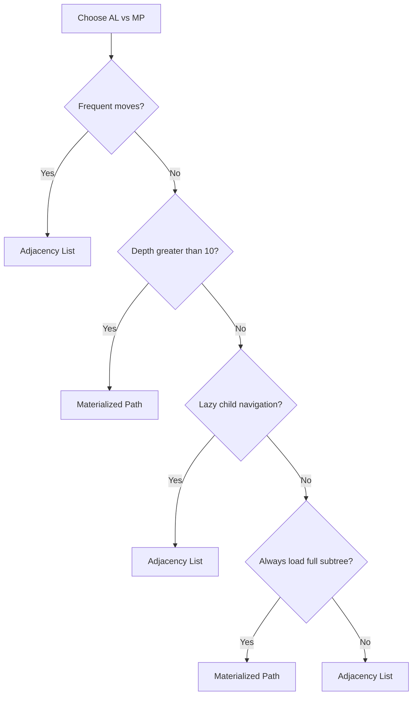
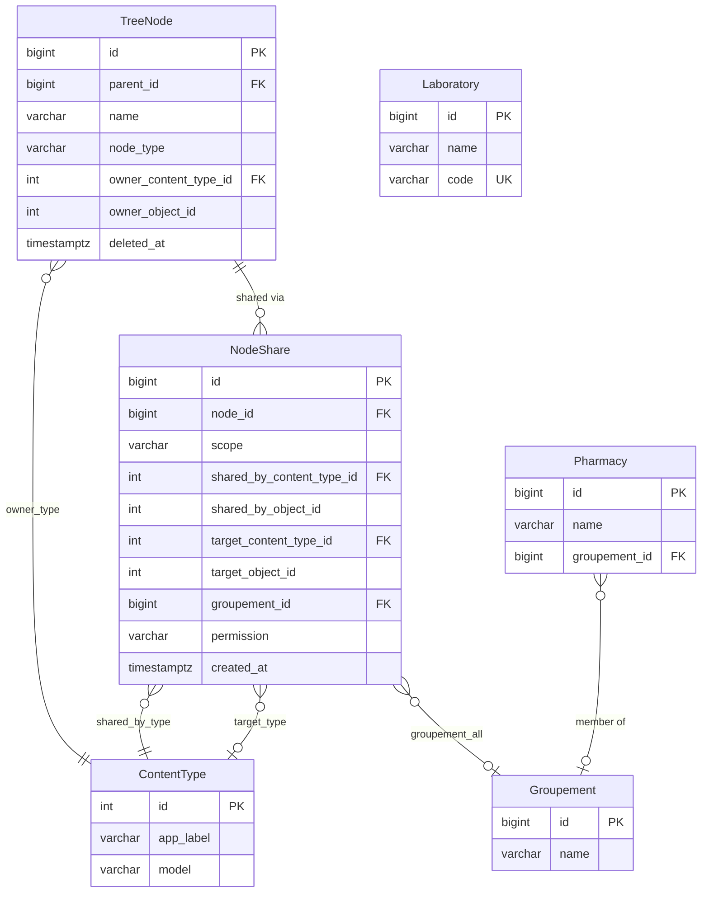
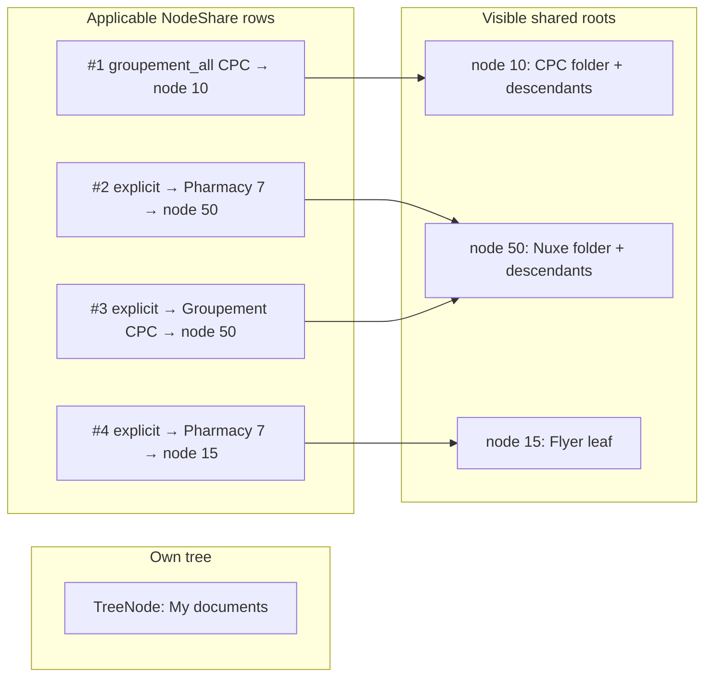
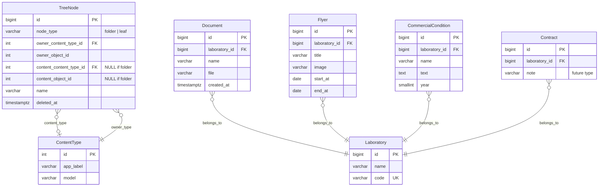
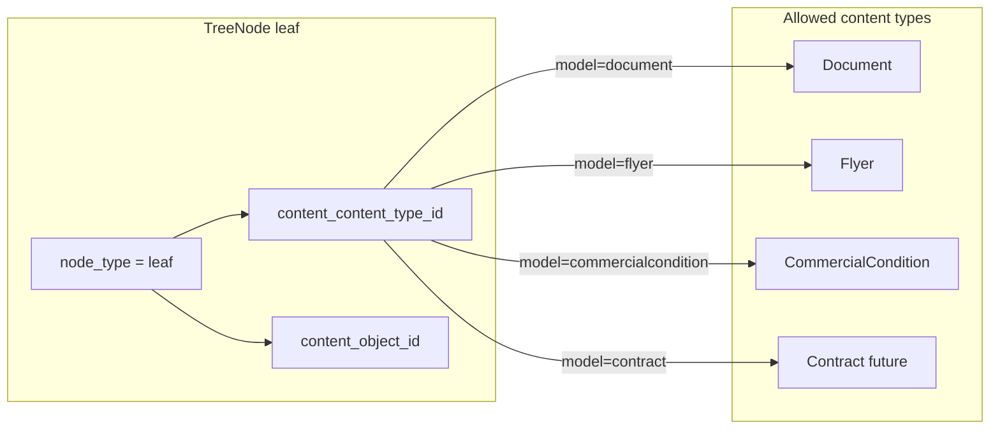
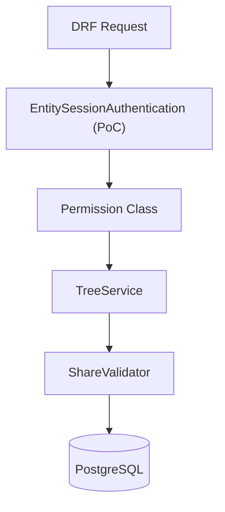
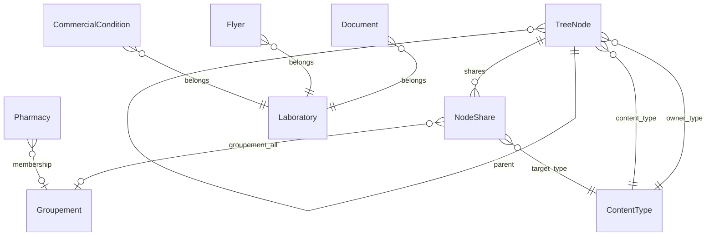

# ADR — Document Tree (draft v0.2)

**Status:** Proposed  
**Context:** B2B SaaS pharmaceutical platform — per-entity document trees with cross-entity sharing  
**Stack:** Django + DRF  
**Decision makers:** [TBD]

---

## Executive summary

We propose an **Adjacency List** (`parent_id`) as the tree structure, **ContentTypes (GenericForeignKey)** for polymorphic owner and polymorphic leaf content, a **`NodeShare`** model for explicit or bulk sharing ("all pharmacies in the groupement"), integrity validation in the service layer + DRF permissions, and a **REST API with a flat list** (`parent_id`) for the aggregated view.

**Database recommendation:** PostgreSQL — justified in [Decision 0](#decision-0--database-choice).

### Decisions at a glance

| Topic | Summary |
|-------|---------|
| [Decision 0 — Database choice](#decision-0-database-choice) | **PostgreSQL** for production and PoC; portable CTE/fallback strategy for tests |
| [Question 1 — Tree structure](#question-1--tree-structure) | **Adjacency List** (`parent_id`); cheap moves and `/children/`; MP/MPTT rejected at expected depth |
| [Question 2 — Polymorphic owner](#question-2--polymorphic-owner) | **ContentTypes GFK** for owner; same pattern on separate fields for leaf content |
| [Question 3 — Sharing model](#question-3--sharing-model) | **`NodeShare`** with explicit target or `GROUPEMENT_ALL`; implicit subtree inheritance |
| [Question 4 — Content polymorphism](#question-4--content-polymorphism) | Dedicated **content GFK** on leaves; resolved via `GET /tree-nodes/{id}/content/` |
| [Question 5 — Extensibility](#question-5--extensibility-contract-in-6-months) | **`Contract`** = new table + allowlist only; no `TreeNode` schema change |
| [Question 6 — Permissions and integrity](#question-6--permissions-and-integrity) | Owner-only mutations; validated shares; **soft delete**; Django session auth in PoC |
| [Question 7 — Aggregated view](#question-7--aggregated-view) | Bootstrap view: own + shared **roots** and **first level only**; lazy `/children/` |
| [Question 8 — API design](#question-8--api-design) | **Flat list** + `parent_id`; core CRUD/navigation endpoints; `is_owned` / `is_shared` metadata |

---

## Decision 0. Database choice

**Answer:** Use **PostgreSQL** for production and the PoC. Recursive CTEs, strong constraints, and partial indexes fit breadcrumb and subtree queries well. The design stays portable: use CTEs when the database supports them, with an iterative Python fallback for lightweight test environments (e.g. SQLite).

| Option                       | Pros                                                                                                      | Cons                                                                                 |
| ---------------------------- | --------------------------------------------------------------------------------------------------------- | ------------------------------------------------------------------------------------ |
| **PostgreSQL (recommended)** | Native recursive CTEs (breadcrumb, subtree); partial indexes; robust constraints; mature Django ecosystem | Slightly more complex infra than SQLite                                              |
| MySQL 8+                     | Recursive CTEs available                                                                                  | Different semantics and constraints; less idiomatic in enterprise Django projects    |
| SQLite                       | Simple for PoC                                                                                            | No efficient recursive CTE in older versions; unsuitable for multi-tenant production |


**Decision:** PostgreSQL for production and PoC (Docker/local). The architecture remains portable — breadcrumb/subtree queries use CTE when available, with an iterative Python fallback for lightweight test environments.

---

## Question 1 — Tree structure

**Answer:** Store the tree as an **Adjacency List** — each `TreeNode` has a nullable `parent_id` pointing to its parent. This keeps child listing and node moves cheap (one indexed query / one update), which matches the dominant read pattern (`/children/`) and the required move endpoint. Materialized Path and MPTT were rejected because move and insert costs outweigh their read advantages at the expected folder depth (3–8 levels).

### Decision: Adjacency List (`parent → TreeNode`)

```python
class TreeNode(models.Model):
    parent = models.ForeignKey(
        'self', null=True, blank=True,
        on_delete=models.CASCADE, related_name='children'
    )
    name = models.CharField(max_length=255)
    node_type = models.CharField(choices=[('folder', 'Folder'), ('leaf', 'Leaf')])
    deleted_at = models.DateTimeField(null=True, blank=True, db_index=True)
    # owner and content defined in Q2/Q4
    # default manager: TreeNode.objects → deleted_at IS NULL
```

### Alternatives considered


| Strategy           | Read (children / ancestors / subtree)              | Write (move / insert)            | Verdict                                     |
| ------------------ | -------------------------------------------------- | -------------------------------- | ------------------------------------------- |
| **Adjacency List** | Children: O(1) with index; ancestors: CTE O(depth) | Move: 1 UPDATE                   | **Chosen**                                  |
| MPTT / Nested Sets | Fast subtree/ancestors                             | Move/insert: cascade renumbering | Rejected — expensive writes                 |
| Closure Table      | Excellent hierarchical queries                     | Move: multiple rows              | Rejected — disproportionate complexity      |
| Materialized Path  | Breadcrumb by prefix                               | Move: recalculate subtree paths  | Valid alternative; discarded for simplicity |


### Use cases that guided the decision

1. **List children** (primary endpoint, high frequency) → simple query `WHERE parent_id = ?`
2. **Breadcrumb** (root → node) → recursive CTE on PostgreSQL or cached loop
3. **Move node** (Phase 2) → one `UPDATE parent_id` + cycle validation
4. **Sharing** → the node stays in the **owner's** tree; recipients see it via `NodeShare`, not structural duplication
5. **Moderate depth** expected (document folders, not giant taxonomies)

### Accepted trade-offs

- Full subtree of a deep node requires CTE or multiple queries — mitigated with `prefetch_related` and index on `parent_id`
- No manual ordering — siblings sorted **alphabetically by `name`** (aligned decision)

### Deep dive — Adjacency List vs Materialized Path

This is the most impactful structural decision in Phase 1. Below we compare the two options **mapped to the real endpoints and operations** from the assessment.

#### How each model is represented

**Adjacency List (AL)** — each node points to its parent:

```
id=10  parent_id=NULL   name="CPC"
id=11  parent_id=10      name="Conditions 2025"
id=12  parent_id=11      name="General conditions"
```

**Materialized Path (MP)** — each node stores the full path from the root (e.g. via django-treebeard `MP_Node`):

```
id=10  path="0001"           depth=1  name="CPC"
id=11  path="00010001"       depth=2  name="Conditions 2025"
id=12  path="000100010001"   depth=3  name="General conditions"
```

The `path` uses fixed-size segments (steplen, e.g. 4 chars) — not a human-readable path like `/CPC/Conditions 2025/`, but a sortable identifier.

#### Operation × strategy matrix


| Operation (Phase 2)                                   | Adjacency List                                       | Materialized Path                                                                         | Winner                                           |
| ----------------------------------------------------- | ---------------------------------------------------- | ----------------------------------------------------------------------------------------- | ------------------------------------------------ |
| **List children** (`GET /children/`)                  | `WHERE parent_id = ?` — 1 query, B-tree index        | `WHERE path LIKE '00010001%'` AND `depth = parent.depth + 1` — 1 query, prefix index      | **Tie** — both O(k) children                     |
| **Breadcrumb** (`GET /breadcrumb/`)                   | Ascending recursive CTE, or N iterative queries      | Parse `path` → fetch nodes by segments, or 1 query with `path__startswith` + depth filter | **MP** — O(1) query if path parsed; no recursion |
| **Full subtree** (aggregated view, share descendants) | Descending recursive CTE                             | `WHERE path LIKE '0001%'` — 1 indexed query                                               | **MP** — avoids recursion                        |
| **Insert node**                                       | 1 INSERT                                             | 1 INSERT + compute next segment among siblings                                            | **AL** — slightly simpler                        |
| **Move node** (reparent)                              | 1 UPDATE `parent_id` + validate cycle                | UPDATE `path` of node **and all descendants** (cascade rewrite)                           | **AL** — clearly cheaper                         |
| **Rename node**                                       | 1 UPDATE `name`                                      | 1 UPDATE `name`                                                                           | **Tie**                                          |
| **Delete subtree**                                    | CASCADE via FK `parent_id` (1 cascade delete in ORM) | CASCADE or delete by `path` prefix                                                        | **Tie**                                          |
| **Detect cycle**                                      | Walk up via `parent_id` or CTE                       | Impossible by construction (path always grows)                                            | **MP** — structural invariant                    |
| **Sibling ordering**                                  | Separate `position` field                            | Lexicographic order embedded in path (treebeard)                                          | **MP** — if manual order matters                 |
| **Django complexity**                                 | Plain model, zero deps                               | `django-treebeard` (`MP_Node`) or manual implementation                                   | **AL**                                           |
| **SQL portability**                                   | Recursive CTE (PG 8.4+, MySQL 8+)                    | Universal `LIKE prefix`, performant with index                                            | **MP** — less CTE-dependent                      |


#### Detail by dimension

**1. Read — lazy navigation (dominant case)**

The assessment expects navigation by children (`/children/`), not loading the entire tree at once. For **direct children**, AL and MP are equivalent in performance:

```sql
-- AL
SELECT * FROM tree_node WHERE parent_id = 10;

-- MP (treebeard)
SELECT * FROM tree_node
WHERE path LIKE '0001____'   -- exactly 1 segment below
  AND depth = 2;
```

Conclusion: if the UI navigates level by level, **MP's advantage almost disappears** on the most frequent endpoint.

**2. Read — breadcrumb**

AL without auxiliary column:

```sql
WITH RECURSIVE ancestors AS (
  SELECT * FROM tree_node WHERE id = 12
  UNION ALL
  SELECT n.* FROM tree_node n
  JOIN ancestors a ON n.id = a.parent_id
)
SELECT * FROM ancestors ORDER BY depth;
-- PostgreSQL: O(depth), typically 3–6 levels → negligible
```

MP:

```python
# path = "000100010001" with steplen=4
segments = ["0001", "0001", "0001"]
paths = ["0001", "00010001", "000100010001"]
TreeNode.objects.filter(path__in=paths).order_by('depth')
# 1 query, zero recursion
```

For document depth (3–8 levels), AL with CTE on PostgreSQL is **~sub-millisecond**. MP wins on elegance and predictability, not practical magnitude in this domain.

**3. Read — aggregated view + share descendants**

This is the most demanding point. When a Pharmacy loads the tree, we need:

- own nodes (AL: `WHERE owner = pharmacy`)
- shared roots via `NodeShare`
- **all descendants** of each shared root

With AL:

```sql
WITH RECURSIVE shared_subtrees AS (
  SELECT id FROM tree_node WHERE id IN (/* shared root ids */)
  UNION ALL
  SELECT n.id FROM tree_node n
  JOIN shared_subtrees s ON n.parent_id = s.id
)
SELECT * FROM tree_node WHERE id IN (SELECT id FROM shared_subtrees);
```

With MP:

```sql
SELECT * FROM tree_node
WHERE path LIKE '0001%' OR path LIKE '0023%' OR ...;
-- one LIKE per shared root, combined with OR
```

MP can be more efficient with **many shared roots and deep subtrees**. With 3–5 shares and depth ≤ 8, both are acceptable. With 50+ labs sharing large folders, MP or caching becomes important.

**4. Write — move node (explicit in Phase 2)**

Scenario: move folder `"Groupement flyers"` (12 children, 2 levels of grandchildren) to another parent.


|              | AL                     | MP                                                     |
| ------------ | ---------------------- | ------------------------------------------------------ |
| Rows updated | **1** (`parent_id`)    | **1 + subtree size** (path rewrite on each descendant) |
| Risk         | Cycle (validate first) | Path collision if concurrent (lock required)           |
| Transaction  | Simple                 | Must be atomic over N rows                             |


For a document system where reorganization is **occasional but legitimate**, AL drastically reduces move cost. MP penalizes exactly the operation required in Phase 2.

**5. Write — insert among siblings (ordering)**

Treebeard MP supports `node.add_sibling(pos='left')` — free manual order via path. With AL, a `position` field + reorder logic is needed. If manual ordering is a strong requirement, MP gains points.

**6. Integrity and validation**

- **AL:** cycle possible (`A → B → C → A`) if validation fails. Mitigation: `TreeService.move()` walks up before UPDATE.
- **MP:** cycle impossible by path invariant. Segment collision possible under concurrency — treebeard uses locks.

**7. Cross-entity sharing**

Both work equally: the node lives in the **owner's** tree; `NodeShare` controls visibility. Storage strategy does not change the share model.

However, in the **aggregated view**, the Pharmacy sees nodes from *other owners'* trees as virtual roots (`parent_id: null` in the API, but real `parent_id` points to the owner's root). This is application logic, independent of AL vs MP.

**8. Django / treebeard**


|                                    | AL              | MP (treebeard)                                            |
| ---------------------------------- | --------------- | --------------------------------------------------------- |
| Dependency                         | None            | `django-treebeard`                                        |
| Model base                         | `models.Model`  | `MP_Node` (different API: `add_child`, `move`, etc.)      |
| Migrations                         | Simple FK       | Table with `path`, `depth`, `numchild`                    |
| Tests                              | Standard Django | Treebeard fixtures                                        |
| Custom fields (GFK owner, content) | Trivial         | Compatible, but `MP_Node` inheritance imposes constraints |


For a technical assessment with custom polymorphic models, AL keeps the model **fully under control** without coupling to the treebeard API.

#### Hybrid approach (third way)

It is possible to combine:

```python
class TreeNode(models.Model):
    parent = models.ForeignKey('self', ...)      # source of truth (AL)
    path = models.CharField(max_length=1024, db_index=True)  # denormalized, maintained on write
```

- **Read** breadcrumb/subtree: use `path` (MP performance)
- **Write** move: update `parent_id` + rebuild subtree `path` (MP cost, but explicit)
- **Risk:** `path` out of sync if poorly maintained — requires discipline in the service layer

Valid if profiling shows CTE as a bottleneck. **Over-engineering for the PoC**, but good documented evolution in the ADR.

#### Decision tree




For this domain:

- Move: **yes** (Phase 2)
- Depth: **moderate** (3–8)
- Navigation: **lazy** (`/children/`)
- Full subtree: **only in aggregated view**, mitigable with lazy root

→ **Adjacency List remains recommended**, with MP documented as evolution if profiling requires it.

#### Revised position in the ADR


| Criterion                      | Weight in domain | AL           | MP            |
| ------------------------------ | ---------------- | ------------ | ------------- |
| Simple `/children/`            | High             | ✓            | ✓             |
| Cheap `/move/`                 | High (Phase 2)   | ✓✓           | ✗             |
| Breadcrumb                     | Medium           | ✓ (CTE)      | ✓✓            |
| Aggregated view subtree        | Medium           | ✓ (CTE)      | ✓✓            |
| Django/polymorphism simplicity | High (PoC)       | ✓✓           | ✓             |
| Sibling ordering               | Low              | alphabetical | embedded path |


**Decision maintained: Adjacency List**, with a note to evolve to AL+path hybrid if production metrics justify it.

> **Scale risks and mitigation:** detailed risk analysis by alternative (AL and MP), mitigation plans, and observability are in the [Risks](#risks) section at the end of this document. Highlights linked to Q1: **R1** (aggregated view degradation with AL) and **R6** (high write scale with MP).

---

## Question 2 — Polymorphic owner

**Answer:** Model the owner with Django **ContentTypes** — a `GenericForeignKey` pair (`owner_content_type`, `owner_object_id`) on `TreeNode`, restricted to `Laboratory`, `Groupement`, and `Pharmacy`. Use the **same mechanism** for leaf content but on **separate fields**, so owner and payload stay independent and both can grow via allowlists without schema changes.

### Decision: GenericForeignKey via `django.contrib.contenttypes`

```python
class TreeNode(models.Model):
    owner_content_type = models.ForeignKey(ContentType, on_delete=models.CASCADE)
    owner_object_id = models.PositiveIntegerField()
    owner = GenericForeignKey('owner_content_type', 'owner_object_id')
```

**Allowed types:** `Laboratory`, `Groupement`, `Pharmacy` — validated in `clean()` / service layer via allowlist:

```python
ALLOWED_OWNER_MODELS = (Laboratory, Groupement, Pharmacy)
```

### Same mechanism for leaf content?

**Yes, same mechanism (ContentTypes), separate fields.**


| Aspect        | Owner                                   | Leaf content                                             |
| ------------- | --------------------------------------- | -------------------------------------------------------- |
| Fields        | `owner_content_type`, `owner_object_id` | `content_content_type`, `content_object_id`              |
| Required      | Always set                              | Only if `node_type == 'leaf'`                            |
| Allowlist     | Laboratory, Groupement, Pharmacy        | Document, Flyer, CommercialCondition (+ Contract future) |
| Business rule | Defines who can edit/move               | Defines payload resolved by endpoint                     |


**Why the same mechanism?**

- Native Django pattern, zero extra dependency
- Uniform extensibility (new type = register in allowlist)
- Clear separation via distinct fields avoids ambiguity

**Why not fixed FKs?**

- Would violate Open/Closed principle — each new type would require a nullable column + migration

**Discarded alternative:** `django-polymorphic` — unnecessary overhead for point references (owner/content), not model inheritance.

---

## Question 3 — Sharing model

**Answer:** Introduce a **`NodeShare`** table that points at the shared node (folder or leaf root) and a recipient — either an explicit entity (`Pharmacy` or `Groupement`) or **all pharmacies in a groupement** via `GROUPEMENT_ALL`. Sharing a folder implicitly exposes its whole subtree at query time; no per-child share rows. A groupement may only share with its member pharmacies; a laboratory may share with any pharmacy or an entire groupement.

### Decision: `NodeShare` with polymorphic target + "all pharmacies" mode

```python
class ShareScope(models.TextChoices):
    EXPLICIT = 'explicit'           # target = specific entity
    GROUPEMENT_ALL = 'groupement_all'  # all pharmacies in a groupement

class NodeShare(models.Model):
    node = models.ForeignKey(TreeNode, on_delete=models.CASCADE, related_name='shares')
    scope = models.CharField(choices=ShareScope.choices, default=ShareScope.EXPLICIT)

    # Who shared (audit + validation)
    shared_by_content_type = models.ForeignKey(ContentType, on_delete=models.CASCADE)
    shared_by_object_id = models.PositiveIntegerField()
    shared_by = GenericForeignKey('shared_by_content_type', 'shared_by_object_id')

    # Explicit target (scope=EXPLICIT)
    target_content_type = models.ForeignKey(ContentType, null=True, on_delete=models.CASCADE)
    target_object_id = models.PositiveIntegerField(null=True)
    target = GenericForeignKey('target_content_type', 'target_object_id')

    # Bulk target (scope=GROUPEMENT_ALL)
    groupement = models.ForeignKey('Groupement', null=True, blank=True, on_delete=models.CASCADE)

    permission = models.CharField(default='read_only')  # only value for now
    created_at = models.DateTimeField(auto_now_add=True)

    class Meta:
        constraints = [
            # scope=explicit → target required, groupement null
            # scope=groupement_all → groupement required, target null
        ]
```

### Database schema — `NodeShare` table

| Column | Type | Null | FK / Ref | Description |
|--------|------|------|----------|-------------|
| `id` | `bigint` PK | NO | — | Surrogate key |
| `node_id` | `bigint` | NO | → `tree_node.id` | Root of shared subtree (folder or leaf); descendants inherited at query time |
| `scope` | `varchar(20)` | NO | — | `explicit` \| `groupement_all` |
| `shared_by_content_type_id` | `int` | NO | → `django_content_type.id` | ContentType of sharer (Laboratory, Groupement) |
| `shared_by_object_id` | `int` UNSIGNED | NO | — | PK of sharer instance |
| `target_content_type_id` | `int` | YES | → `django_content_type.id` | Required when `scope=explicit`; ContentType of recipient |
| `target_object_id` | `int` UNSIGNED | YES | — | PK of recipient (Pharmacy or Groupement) |
| `groupement_id` | `bigint` | YES | → `groupement.id` | Required when `scope=groupement_all` |
| `permission` | `varchar(20)` | NO | — | Default `read_only` (only value for now) |
| `created_at` | `timestamptz` | NO | — | Audit timestamp |

**Check constraints:**

| Name | Rule |
|------|------|
| `nodeshare_scope_explicit` | `scope='explicit'` → `target_content_type_id` AND `target_object_id` NOT NULL; `groupement_id` IS NULL |
| `nodeshare_scope_groupement_all` | `scope='groupement_all'` → `groupement_id` NOT NULL; `target_*` IS NULL |

**Indexes:**

| Index | Columns | Purpose |
|-------|---------|---------|
| `nodeshare_node_idx` | `(node_id)` | Shares by node (revocation, audit) |
| `nodeshare_target_idx` | `(target_content_type_id, target_object_id)` | Resolve shares for a pharmacy/groupement |
| `nodeshare_groupement_all_idx` | `(groupement_id)` WHERE `scope='groupement_all'` | Partial index for bulk scope |
| `nodeshare_shared_by_idx` | `(shared_by_content_type_id, shared_by_object_id)` | Audit by sharer |

### Schema diagram — sharing model



**Relationship notes:**

- `NodeShare.node` → always points to the **shared root**; no row per descendant.
- `shared_by` (GFK) → Laboratory or Groupement that created the share.
- `target` (GFK) → Pharmacy or Groupement when `scope=explicit`.
- `groupement` → used only when `scope=groupement_all`; all `Pharmacy` rows with matching `groupement_id` gain access.

### Share scenarios — table view

Example rows aligned with the assessment diagram (CPC groupement → pharmacy member; Nuxe lab → pharmacy):

| id | node_id | scope | shared_by | target / groupement | Who sees it |
|----|---------|-------|-----------|---------------------|-------------|
| 1 | 10 *(folder "CPC")* | `groupement_all` | Groupement CPC (#3) | `groupement_id=3` | All pharmacies in CPC |
| 2 | 50 *(folder "Nuxe")* | `explicit` | Laboratory Nuxe (#8) | Pharmacy #7 | Pharmacy #7 only |
| 3 | 50 *(folder "Nuxe")* | `explicit` | Laboratory Nuxe (#8) | Groupement CPC (#3) | All pharmacies in CPC (via membership) |
| 4 | 15 *(leaf "Flyer")* | `explicit` | Groupement CPC (#3) | Pharmacy #7 | Pharmacy #7 only *(must pass `pharmacy.groupement_id == 3`)* |

**Resolution for Pharmacy #7 (member of CPC):**



### Business rules


| Source     | Can share with                    | Validation                            |
| ---------- | --------------------------------- | ------------------------------------- |
| Groupement | Specific pharmacies (`Pharmacy`)  | `pharmacy.groupement_id == sharer.id` |
| Groupement | All pharmacies (`GROUPEMENT_ALL`) | `groupement == sharer`                |
| Laboratory | Entire groupement (`Groupement`)  | pharmacies see via membership         |
| Laboratory | Individual pharmacy (`Pharmacy`)  | **no groupement restriction**         |


### Implicit subtree inheritance

Sharing a **folder** implies visibility of **all descendants** — without per-child `NodeShare` records. Resolved at query time:

```
node visible IF:
  owner == requesting_entity
  OR ∃ share S where S.node is ancestor of node (or S.node == node)
     AND requesting_entity matches S.target / S.groupement
```

Implementation: resolve shares applicable to entity → collect shared root `node_id`s → include descendants via CTE or prefetch.

### Known limitations

1. **Partial revocation:** cannot hide a child of a shared folder without restructuring
2. **`GROUPEMENT_ALL` resolution:** new pharmacy added to groupement gains access automatically (by design); removed pharmacy loses access
3. **Performance:** many shares + deep trees → cache of "applicable shares per entity" may be needed
4. **Lab → Pharmacy direct:** allowed **with no groupement restriction** — lab can share with any pharmacy individually
5. **No copy-on-write:** recipients never own a structural copy — simplifies integrity, limits "local customization"

---

## Question 4 — Content polymorphism

**Answer:** Leaf nodes reference their business object through a dedicated **`GenericForeignKey`** (`content_content_type`, `content_object_id`), separate from the owner fields. Folders leave content null; leaves must point to an allowed type (`Document`, `Flyer`, `CommercialCondition`). Resolution is handled by `GET /tree-nodes/{id}/content/`, which returns the underlying object with a `content_type` discriminator and signed file URLs where applicable.

### Decision: dedicated GenericForeignKey (fields separate from owner)

```python
class TreeNode(models.Model):
    content_content_type = models.ForeignKey(
        ContentType, null=True, blank=True, on_delete=models.SET_NULL
    )
    content_object_id = models.PositiveIntegerField(null=True, blank=True)
    content = GenericForeignKey('content_content_type', 'content_object_id')
```

**Invariants:**

- `node_type == 'folder'` → `content` must be `NULL`
- `node_type == 'leaf'` → `content` required, type in allowlist
- Referenced object must belong to a coherent `laboratory` (cross-validation in service layer)

### Schema diagram — content polymorphism

Leaf nodes reference business objects via a **GenericForeignKey** (`content_content_type_id` + `content_object_id`). There is no direct FK column per content type — Django resolves the target at runtime via `django_content_type`.



**Logical GFK resolution** (not enforced by DB FK):



**Column rules on `tree_node` (content fields):**

| `node_type` | `content_content_type_id` | `content_object_id` | Example |
|-------------|---------------------------|---------------------|---------|
| `folder` | `NULL` | `NULL` | `"Conditions 2025"` — container only |
| `leaf` | → `ContentType(Document)` | `5` | points to `Document #5` |
| `leaf` | → `ContentType(Flyer)` | `38` | points to `Flyer #38` |
| `leaf` | → `ContentType(CommercialCondition)` | `12` | points to `CommercialCondition #12` |

**Resolution endpoint:** `GET /tree-nodes/{id}/content/` → serializes underlying object with `content_type` discriminator.

**File URLs:** response includes **signed URL with short TTL** for `Document.file` and `Flyer.image`. Storage details (S3/GCS, credential rotation) are **out of PoC scope** — assume configurable adapter via Django settings.

---

## Question 5 — Extensibility (Contract in 6 months)

**Answer:** Adding **`Contract`** requires a new model table and code changes only — **no migration on `TreeNode`**. Register `Contract` in the content allowlist and in the leaf resolution serializer registry. The GFK schema already supports new content types without new columns.

### Impact of adding `Contract`


| Layer                 | Migration required? | Change                                    |
| --------------------- | ------------------- | ----------------------------------------- |
| `Contract` model      | **Yes** — new table | Follow existing model pattern             |
| `TreeNode`            | **No**              | GFK schema unchanged                      |
| Content allowlist     | No (code)           | `ALLOWED_CONTENT_TYPES += Contract`       |
| Resolution serializer | No (code)           | Register `ContractSerializer` in registry |
| Tests                 | No (code)           | Cases for Contract leaf                   |
| Admin / docs          | No (code)           | Optional                                  |


**Principle:** Open/Closed — extension by registration, not schema change.

---

## Question 6 — Permissions and integrity

**Answer:** Enforce integrity in the **service layer** and DRF permission classes. Only the **node owner** may mutate (edit, move, share); shared nodes are read-only for recipients (`is_shared: true`). Share creation is validated centrally — a groupement cannot share with a pharmacy outside its membership. Nodes use **soft delete** (`deleted_at`); deleted nodes are hidden from all readers. In the PoC, the requesting entity is bound to the **Django session** via `POST /session/entity/`; tree GET endpoints read it server-side. JWT claims are documented for production.

### Requesting entity context

**PoC / Phase 2:** the client selects an entity once with `POST /api/v1/session/entity/` (`entity_type`, `entity_id`). The server validates the entity exists and stores it in the session. All tree **read** endpoints require that session cookie and resolve the active entity through `EntitySessionAuthentication`. Authorization still compares the session entity with `node.owner` and applicable shares via `TreeService.can_entity_access_node`. When the node exists but the entity lacks access, the API returns **403** with `"Entity does not have permission"`. Unknown node IDs return **404**.

**Production (documented, not implemented in PoC):** migrate to **JWT claim** (`entity_type`, `entity_id` in token). The `TreeService` layer receives the already-resolved entity — switching mechanism stays isolated in DRF authentication.

**Mutations (PoC):** share and move endpoints still accept `sharer_type` / `owner_type` in the request body; binding mutations to session is a follow-up.

### Defense layers




### 6a — Pharmacy cannot modify shared node

- **Rule:** mutations (`PUT/PATCH/DELETE`, move, share) allowed only if `request.entity == node.owner`
- **DRF implementation:** `IsNodeOwner` permission class
- Nodes visible via share are flagged with `is_shared: true`; the UI treats shared nodes as read-only (mutations enforced server-side via `IsNodeOwner`)

### 6b — Prevent share with wrong pharmacy

Centralized validation in `ShareService.create_share()`:

```python
def validate_share(sharer, node, target, scope):
    assert node.owner == sharer
    if isinstance(sharer, Groupement):
        if scope == EXPLICIT and isinstance(target, Pharmacy):
            assert target.groupement_id == sharer.id
    # Laboratory → Groupement or Pharmacy: no membership restriction
```

- **DB constraints:** `CheckConstraint` for scope/target consistency; FK `groupement` with `PROTECT`
- **Atomic transaction** on share creation

### 6c — Soft delete

**Decision:** nodes support **soft delete** via `deleted_at` field (nullable datetime).

```python
class TreeNode(models.Model):
    deleted_at = models.DateTimeField(null=True, blank=True, db_index=True)
    # default manager excludes deleted_at IS NOT NULL
```

**Behavior:**

- Read queries (`/tree/`, `/children/`, breadcrumb) filter `deleted_at IS NULL`
- Soft-deleted node **not visible** to recipients via share (implicitly treated as revoked)
- Mutations on deleted node return 404
- Restore possible via future endpoint (`POST /tree-nodes/{id}/restore/`) — out of minimum PoC scope, but schema prepared
- Hard purge (GDPR/retention) as future async job

---

## Question 7 — Aggregated view

**Answer:** The aggregated endpoint returns a **bootstrap view**: the entity's **own root nodes** plus **shared root nodes**, each with **direct children only** (one level deep). Deeper nodes are loaded lazily via `/children/`. The response is a flat list with `parent_id`, `is_owned`, `is_shared`, and `shared_by` — no full subtree and no recursive CTE on initial load.

### Decision

When an entity (e.g. a Pharmacy) loads its document tree, the aggregated endpoint builds a **bootstrap view** in two parts: **own nodes** and **shared nodes**. It does **not** load full subtrees in one response.

1. **Own nodes** — query all `TreeNode` rows owned by the requesting entity, then include **root-level folders/leaves** (`parent_id IS NULL`) and **their direct children only** (first level below each owned root).

2. **Shared nodes** — resolve applicable `NodeShare` records for the entity (explicit shares, groupement membership, `GROUPEMENT_ALL`), collect the **shared root nodes**, then include each shared root and **its direct children only** (first level of folders/leaves under that share).

3. **Deeper levels** — anything below the first level is **not** returned by the aggregated view. The client loads them on demand via `GET /tree-nodes/{id}/children/` as the user expands folders.

This keeps the initial payload small, avoids expensive recursive CTEs on every page load (see [R1](#r1--aggregated-view-degradation-high-priority)), and matches typical tree UI behaviour: show top-level sections (own documents, CPC, Nuxe…) and one level of contents; drill down lazily.

Each node in the response is a flat row with `parent_id`, plus metadata (`is_owned`, `is_shared`, `shared_by`). Siblings are sorted **alphabetically by `name`**. Shared nodes are read-only — derived from `is_shared: true`, not a separate response field.

### Construction strategy

For entity `E` (e.g. Pharmacy):

**Step 1 — Own nodes (depth-limited):**

```sql
-- Roots owned by E
SELECT * FROM tree_node
WHERE owner = E AND parent_id IS NULL AND deleted_at IS NULL;

-- First-level children of those roots
SELECT * FROM tree_node
WHERE owner = E AND parent_id IN (<owned_root_ids>) AND deleted_at IS NULL;
```

**Step 2 — Shared roots:**

```sql
-- Applicable shares for E:
--   explicit shares targeting E (Pharmacy)
--   shares targeting E's Groupement (lab → groupement)
--   GROUPEMENT_ALL where groupement = E.groupement

SELECT DISTINCT node_id FROM node_share WHERE <applicable_to E>;
```

**Step 3 — First-level children of shared roots only:**

```sql
SELECT * FROM tree_node
WHERE parent_id IN (<shared_root_ids>) AND deleted_at IS NULL;
```

**Step 4 — Assembly:** merge own + shared node sets, deduplicate, attach metadata (`is_shared`, `shared_by`), return flat list. Shared roots appear with `parent_id: null` in the API when mounted as top-level sections for the recipient (application-layer presentation).

```json
{
  "id": 42,
  "name": "Conditions 2025",
  "parent_id": 10,
  "node_type": "folder",
  "is_shared": true,
  "shared_by": {"entity_type": "groupement", "id": 3, "name": "CPC"}
}
```

**What is excluded from this endpoint:** descendants below depth 1 under any root (owned or shared). Example: if `"CPC"` is shared and `"Conditions 2025"` is a direct child, `"General conditions"` (grandchild) is **not** included until the client calls `/children/` on node `"Conditions 2025"`.

**Shared node naming:** `TreeNode.name` stores only the real name (e.g. `"CPC"`). The UI builds the full label combining `name` + `shared_by` object — e.g. *"CPC [shared by Groupement]"*. No suffix persisted in the database.

### Performance implications


| Scenario                      | Risk          | Mitigation                                                              |
| ----------------------------- | ------------- | ----------------------------------------------------------------------- |
| Pharmacy with many lab shares | Large share resolution query | Composite index on `(target_content_type, target_object_id)` |
| Many shared roots at depth 0  | Wide first-level result set  | Pagination on `/tree/` if root count exceeds limit           |
| N+1 in serialization          | API latency   | `select_related` / `prefetch_related` on share metadata                 |
| User expands deep folders     | Repeated `/children/` calls  | Acceptable — indexed `parent_id` lookup per level; optional cache       |

Depth-limited aggregation avoids recursive CTE cost on initial load; subtree CTE remains available for `/children/` or breadcrumb if needed at deeper levels.

---

## Question 8 — API design

**Answer:** Expose the tree as a **flat JSON list** with `parent_id` (not nested JSON). Core endpoints: aggregated tree per entity, list children, resolve leaf content, and create shares; Phase 2 adds breadcrumb and move. Own vs shared nodes are distinguished by `is_owned` / `is_shared` and optional `shared_by` metadata; siblings are ordered alphabetically by `name`.

### Representation: flat list + `parent_id`

Rationale: compatible with tree UI components (MUI TreeView, react-arborist), paginable, avoids deep nested JSON.

### Main endpoints


| Method | Path                                               | Description                      |
| ------ | -------------------------------------------------- | -------------------------------- |
| `POST` | `/api/v1/session/entity/`                          | Bind active entity to session    |
| `GET`  | `/api/v1/entities/tree/`                           | Aggregated view (own + shared)   |
| `GET`  | `/api/v1/tree-nodes/{id}/children/`                | Direct children of a node        |
| `GET`  | `/api/v1/tree-nodes/{id}/content/`                 | Resolve leaf → underlying object |
| `POST` | `/api/v1/tree-nodes/{id}/shares/`                  | Share node                       |


**Additional endpoints (Phase 2):**

- `GET /api/v1/tree-nodes/{id}/breadcrumb/`
- `PATCH /api/v1/tree-nodes/{id}/move/`

### Own vs shared distinction

Fields in response (all read endpoints):

```json
{
  "name": "CPC",
  "is_owned": false,
  "is_shared": true,
  "shared_by": {"entity_type": "groupement", "id": 3, "name": "CPC"}
}
```

- `name` — persisted value, no sharing suffix
- `shared_by` — present when `is_shared: true`; UI composes display label
- `is_owned: true` → node belongs to request context entity; mutations allowed
- `is_shared: true` → visible via `NodeShare`; read-only (UI disables edit/delete/move; server rejects mutations)

**Ordering:** children returned sorted by `name` ASC.

### Example — aggregated view (Pharmacy)

```
POST /api/v1/session/entity/
{"entity_type": "pharmacy", "entity_id": 7}
→ 201 Created (Set-Cookie: sessionid=...)

GET /api/v1/entities/tree/
Cookie: sessionid=...
→ 200 OK
[
  {"id": 1, "name": "My documents", "parent_id": null, "is_owned": true, ...},
  {"id": 2, "name": "VAT declaration", "parent_id": 1, "node_type": "leaf", ...},
  {"id": 10, "name": "CPC", "parent_id": null, "is_shared": true,
   "shared_by": {"entity_type": "groupement", "id": 3, "name": "CPC"}, ...},
  ...
]
```

---

## Model diagram (overview)




---

## Assumptions and Decisions

Architectural assumptions and resolved design choices for this ADR:


| #   | Topic                        | Decision                                                                                                   |
| --- | ---------------------------- | ---------------------------------------------------------------------------------------------------------- |
| 1   | **Lab → Pharmacy direct**    | Allowed **without restriction** — laboratory can share with any pharmacy, regardless of groupement         |
| 2   | **Sibling ordering**         | **Alphabetical by `name`** — no `position` field in PoC                                                    |
| 3   | **Shared node naming**       | Separate fields: `name` (persisted) + `shared_by` (API metadata); UI builds label                          |
| 4   | **Authentication / context** | **Django session** in PoC (`POST /session/entity/`); JWT claim documented as production evolution            |
| 5   | **Soft delete**              | **`deleted_at`** — deleted nodes invisible; shares implicitly inactive; restore out of minimum scope       |
| 6   | **Expected scale**           | ADR assumptions maintained: 50–200 nodes/owner (PoC), up to 50k (production); 500–2k pharmacies/groupement |
| 7   | **File storage**             | Leaf resolution returns **signed URL**; object storage infra out of PoC scope                              |


---

## Risks

Risk analysis for **scale growth** — more pharmacies, laboratories, shares, and deeper trees — with mitigation plans **by storage alternative** (Adjacency List vs Materialized Path). Primarily related to [Question 1](#question-1--tree-structure).

Thresholds are indicative; the real trigger should be metrics (p95/p99 latency, PG CPU, error rate).

### Assumed scale scenarios


| Dimension                                     | Initial scale (PoC) | High scale (mature production) |
| --------------------------------------------- | ------------------- | ------------------------------ |
| Pharmacies per groupement                     | 10–50               | 500–2,000                      |
| Laboratories sharing with one pharmacy        | 3–10                | 50–200                         |
| Nodes per owner tree                          | 50–200              | 5,000–50,000                   |
| Maximum depth                                 | 3–8                 | 10–20                          |
| `GET /tree/` requests (aggregated view) / min | low                 | peak: hundreds concurrent      |
| `move` operations / min                       | occasional          | dozens (bulk reorganization)   |


### Risks — Adjacency List (current decision)

#### R1 — Aggregated view degradation (high priority)

**Trigger:** pharmacy with 50+ shared roots (labs + groupement), subtrees with thousands of nodes, or p99 of `GET /entities/.../tree/` > 500 ms.

**Mechanism:** aggregated view requires (a) own nodes query, (b) applicable shares resolution, (c) **descending recursive CTE** per shared root, (d) merge + deduplication + serialization. At scale, CTE scans many rows; multiple roots multiply cost; PostgreSQL worktable memory grows.

**Impact:** API latency, timeouts, connection pool pressure, degraded UI initial load experience.

**Mitigation plan (phases):**


| Phase                      | Action                                                                                                                                            | Effort               |
| -------------------------- | ------------------------------------------------------------------------------------------------------------------------------------------------- | -------------------- |
| **1 — Immediate**          | Aggregated view returns **depth=1 only** (roots + direct children); deep navigation via `/children/`                                              | Low — already in ADR |
| **2 — Query optimization** | Consolidate single CTE with multiple roots (`WHERE root_id IN (...)`), indexes on `(parent_id)`, `(owner_content_type, owner_object_id)`          | Low                  |
| **3 — Read cache**         | Redis cache keyed by `(entity_type, entity_id, tree_version)` with TTL 60–300 s; invalidate on node/share mutation for entity or relevant sharers | Medium               |
| **4 — Denormalization**    | Add `path` column (AL+path hybrid) **read-only** for subtree/breadcrumb; `parent_id` remains source of truth                                      | Medium               |
| **5 — Pre-computation**    | Async job (Celery) materializes aggregated view snapshot per pharmacy when shares change; API serves snapshot + delta                             | High                 |
| **6 — Structural change**  | Migrate to MP **or** Closure Table if R1 persists after phases 1–5                                                                                | High                 |


**Escalation criteria:** if p99 > 500 ms after phases 1–3, start phase 4; if > 1 s after phase 4, evaluate phase 5 or 6.

#### R2 — Recursive CTE and PostgreSQL limits

**Trigger:** depth > 15, or insufficient `work_mem` causing disk spills in EXPLAIN ANALYZE.

**Impact:** intermittent slow queries; unstable execution plan.

**Mitigation:**

- Set appropriate `statement_timeout` and `work_mem` per read role
- Limit maximum depth in validation (`TreeService.create_node`, `move`)
- Breadcrumb: cache by `node_id` (invalidate on move of node or any ancestor)
- Fallback: iterative loop in Python with batch fetch (acceptable for breadcrumb only, not large subtree)

#### R3 — Hot spot on `tree_node` table (insert writes)

**Trigger:** thousands of simultaneous uploads creating leaves under the same folder.

**Impact:** contention on `parent_id` index; locks on parent row (FK check).

**Mitigation:**

- Bulk insert via `bulk_create` in batches
- Future partitioning by `owner_content_type + owner_object_id` (PostgreSQL declarative partitioning) if one entity has > 100k nodes
- Rate limiting per entity on creation API

#### R4 — Cycle validation on move (AL-specific)

**Trigger:** move in deep tree under concurrency.

**Impact:** O(depth) walk-up per request; possible cycle if race condition.

**Mitigation:**

- `SELECT ... FOR UPDATE` on moved node and new parent within transaction
- Walk-up with depth limit (= max depth config)
- Concurrency tests in `TreeService.move()`

#### R5 — `NodeShare` table growth (common to both alternatives)

**Trigger:** lab shares with 2,000 pharmacies individually (`scope=EXPLICIT`) instead of `GROUPEMENT_ALL`.

**Impact:** slow applicable shares query; row explosion.

**Mitigation:**

- Prefer `GROUPEMENT_ALL` when target is entire groupement
- Composite index `(target_content_type, target_object_id, node_id)`
- Partition shares by `shared_by_content_type` if needed
- Product rule: discourage bulk explicit shares when groupement scope exists

### Risks — Materialized Path (alternative not chosen)

Documented for honest comparison and to guide evolution (hybrid or migration).

#### R6 — High write scale on move/reorganization (high priority for MP)

**Trigger:** frequent `move` operations (bulk reorganization, intensive drag-and-drop, document migration scripts), or folders with 500+ node subtrees moved regularly.

**Mechanism:** each `move` rewrites `path` (and `depth`, `numchild`) on **all descendants**. Moving a folder with 5,000 nodes = 5,000 indexed UPDATEs in one transaction.

**Impact:** long transactions, lock escalation, replication lag (if read replicas), timeouts, read blocking on subtree during move.

**Mitigation plan (if MP were adopted):**


| Phase | Action                                                                                 | Effort |
| ----- | -------------------------------------------------------------------------------------- | ------ |
| **1** | Limit depth and movable subtree size via API (validate `descendant_count` before move) | Low    |
| **2** | Async move: API returns 202, treebeard job in background; UI shows "moving..." state   | Medium |
| **3** | Batch UPDATE with set-based SQL `path` recalculation (avoid ORM row-by-row)            | Medium |
| **4** | Queues per owner — serialize moves on same tree                                        | Medium |
| **5** | Revert to AL for write hot paths **or** hybrid (AL write + async path rebuild)         | High   |


**Why AL was preferred:** this risk (R6) is inherent to MP and **correlated with Phase 2** (`/move/`). AL avoids the problem at the source.

#### R7 — Write contention on insert among siblings (MP)

**Trigger:** many concurrent inserts as children of the **same parent** (e.g. batch upload in a folder).

**Mechanism:** treebeard computes next path segment under parent lock (`numchild`, sibling scan).

**Impact:** serialized writes on same parent; limited throughput.

**Mitigation (MP):**

- Queue `add_child` by `parent_id`
- Larger steplen to reduce collisions (trade-off: longer path)
- AL avoids this lock pattern — insert is 1 independent row

#### R8 — Path segment exhaustion (MP)

**Trigger:** > `16^steplen` siblings at same level (steplen=4 → 65,536 siblings) — unlikely in document trees, but possible on flat root node.

**Impact:** cannot insert new sibling; treebeard error.

**Mitigation:** configurable steplen; offline path reshuffle; AL has no such limit.

#### R9 — Prefix index degradation on MP reads

**Trigger:** `tree_node` table > 10M rows, many `LIKE 'XXXX%'` with low-selectivity prefixes (shallow roots with huge subtrees).

**Impact:** expensive sequential or bitmap scans; worsens with OR of many prefixes in aggregated view.

**Mitigation:**

- GIN index with `pg_trgm` on `path` (PostgreSQL) for prefixes
- Restrict aggregated view to depth=1 + lazy load
- AL suffers less from this pattern on `/children/` (equality on `parent_id` is more selective)

### Common risks (AL and MP)

#### R10 — Incorrect cache invalidation

**Trigger:** share revoked or node moved; cache serves stale tree.

**Impact:** access leak (security) or outdated content.

**Mitigation:**

- `tree_version` incremented on any relevant mutation (node, share, pharmacy membership)
- Cache key includes `tree_version`
- Short TTL (60 s) as safety net
- Integration tests: revocation → cache miss on next request

#### R11 — Aggregated view and JSON payload limits

**Trigger:** flat list response with 20k+ nodes in single `GET /tree/`.

**Impact:** serializer memory, gateway timeout (nginx 60 s), frozen UI.

**Mitigation (independent of AL/MP):**

- Level pagination (`?depth=1`, cursor by parent)
- Hard limit `MAX_NODES_PER_RESPONSE` (e.g. 500) with `next` link
- API contract: aggregated view = bootstrap, not full export

#### R12 — Read replica lag (future read replica)

**Trigger:** write move (MP worse) + immediate read on replica.

**Impact:** UI shows inconsistent tree post-move.

**Mitigation:**

- Read-your-writes: route mutator's requests to primary for N seconds
- AL move (1 row) minimizes window; MP move (N rows) amplifies lag

### Summary matrix — risk × alternative


| ID  | Risk                      | AL       | MP       | Primary mitigation               |
| --- | ------------------------- | -------- | -------- | -------------------------------- |
| R1  | Slow aggregated view      | **High** | Medium   | Lazy depth + cache + hybrid path |
| R2  | CTE / depth               | Medium   | Low      | Limit depth, cache breadcrumb    |
| R3  | Insert hot spot           | Medium   | Medium   | bulk_create, partitioning        |
| R4  | Cycle on move             | Low      | N/A      | FOR UPDATE + walk-up             |
| R5  | NodeShare explosion       | High     | High     | GROUPEMENT_ALL, indexes          |
| R6  | Move at scale             | Low      | **High** | AL avoids; MP → async move       |
| R7  | Concurrent sibling insert | Low      | **High** | AL preferable                    |
| R8  | Path segment exhaustion   | N/A      | Low      | steplen / reshuffle              |
| R9  | Index prefix scan         | Low      | Medium   | lazy load, trgm index            |
| R10 | Stale cache               | High     | High     | tree_version                     |
| R11 | Oversized payload         | High     | High     | level pagination                 |
| R12 | Post-write replica lag    | Low      | **High** | read-your-writes                 |


### Observability strategy

Minimum metrics before scaling mitigations:

- `document_tree.aggregated_view.duration` (p50, p95, p99) by `entity_type`
- `document_tree.aggregated_view.node_count` (histogram)
- `document_tree.move.duration` + `descendants_updated` (critical if MP)
- `document_tree.share.resolution.count` — applicable shares per request
- PostgreSQL: `pg_stat_statements` top queries on `tree_node` and `node_share`

**Suggested alerts:**

- p99 aggregated view > 500 ms for 5 min → review cache (R1)
- move updates > 100 rows (MP) → alert product / throttling (R6)
- share count per pharmacy > 100 → review share modeling (R5)

---
